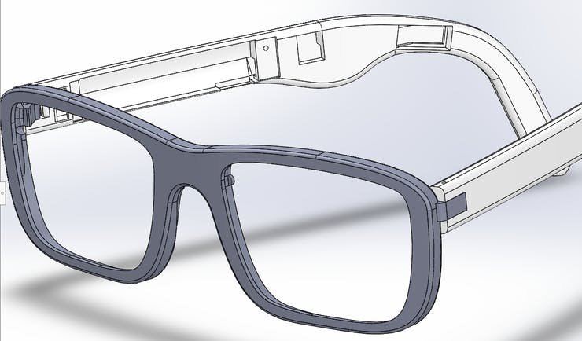
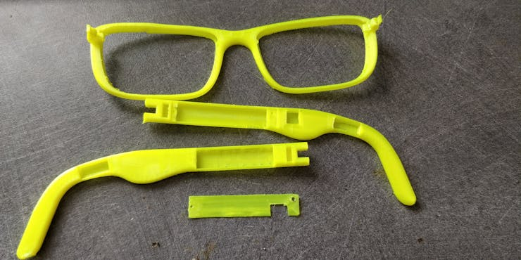
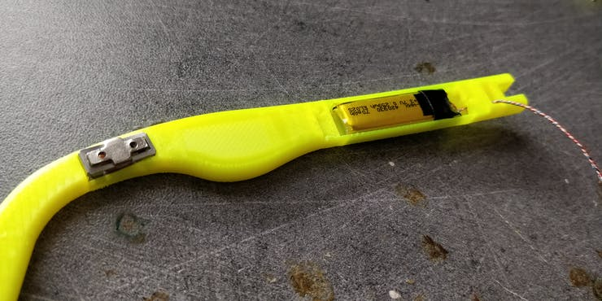
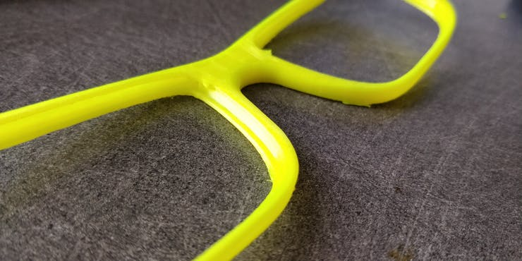
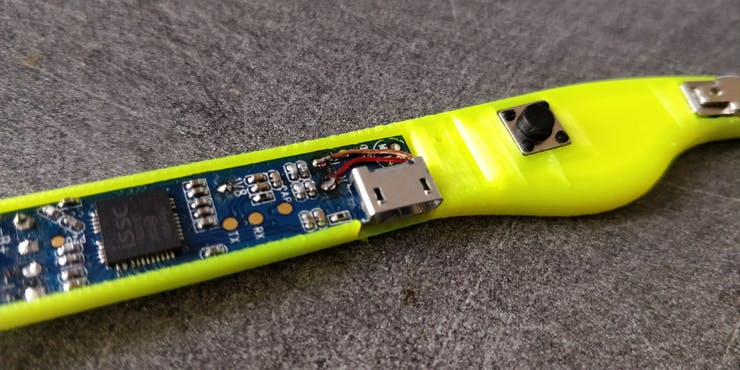
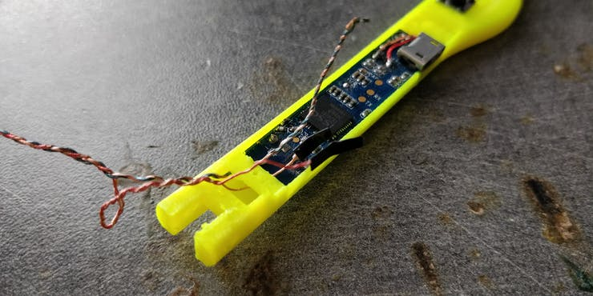
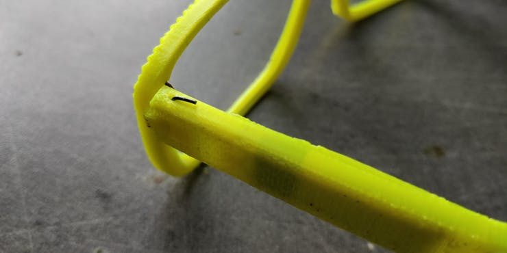
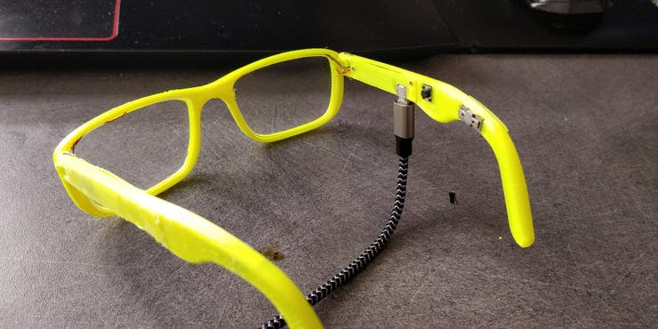
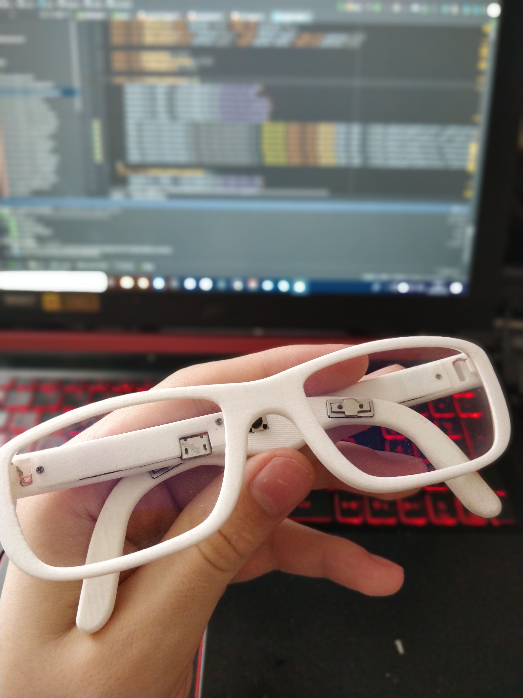

I had a really boring class in high school and short story I made bone conduction glasses

<!--more-->

## Why and how

I had a really boring class in high school and I've seen product pages of bone conduction glasses and boy they were expensive. So I m bought two bone conduction modules from AliExpress (The GD-02 model) the module itself is about 12.6*6*4mm.



Next I had to search for a Bluetooth module to be able to receive the music. I tried to search for an ic that I could put on a pcb but a friend had his old wireless earphones broken, fortunately the receiver part and the battery still works, so I used that

So this has taken so long to make everything fit inside and make the glasses a minimum stylish / comfortable. All the design have been created using SolidWorks.

I don't have screenshot of all the diff rents versions I went through but after more the 50 hours in SolidWorks I came up with this model:

After some 3d printing the part came out pretty nice:

The 3d model is open source on [Thingiverse](https://www.thingiverse.com/thing:3552193)

## Wiring
First I had to find a way to connect the battery and the left module (Which is on the left branch) to the right branch. The only way that I found to make this work is to get some old Chinese ear buds cut the cable remove the rubber insulation and you got 4 isolated wire that is very tiny.

To not make a mess when assembling later on I braided the 4 cables together and cut them to the appropriate size.

Then I disconnected the original wire that were on the battery and replace them with my own wires.

## Assembly
Assembly was tricky first I need to pass the cable trough the left branch hole, next I need to pass the left speaker cable to the correct hole and the solder the module. Next I can put the battery inside the hole and close the lid with 2 screws.

Next you need to pass the cable in the middle hole of center part of the glasses

Next we can assemble the right branch. First cut thin cable to solder to the right module and solder them to it, do the same for the on/off/recall button then cut the wires to size and solder them to the module:

Then trim the wire comming from the left branch while being VERY CAREFUL to not short the battery wire pass them to the hole and solder it to the main board.

Then put a piece of solid wire to fix the branches to the main body

Next I placed my old correction lenses on the assembly and after an overnight charge and enjoy music. I repeat, it's not very loud but still audible and lacks a bit of bass but overall a great project. Also, I didn't expect this but there is not a ton of sound leakage it's relatively quiet. And some other pictures to finish the post:

After discussing my project with my high school mechanical teacher he agreed to print it on the school powder printer and here is the final version:

