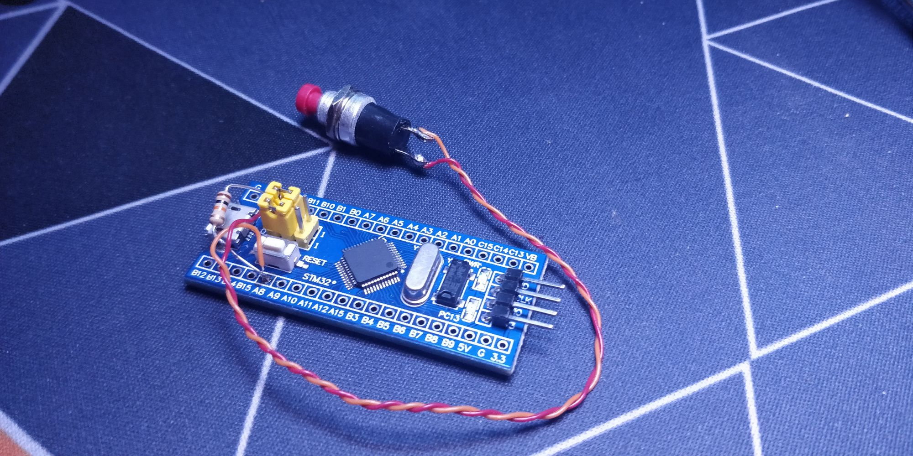
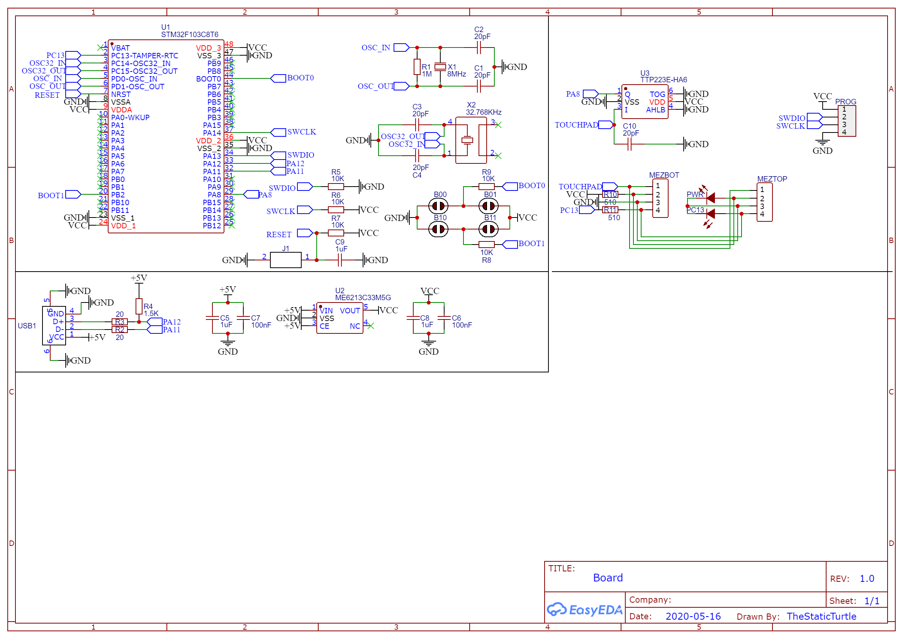
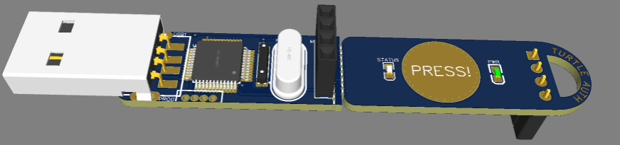
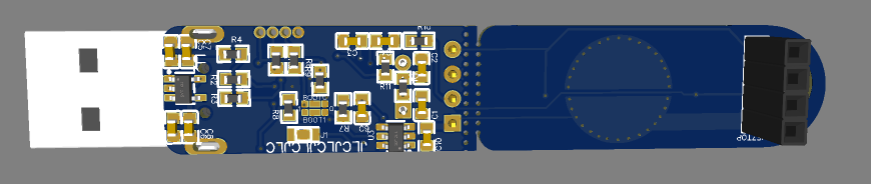
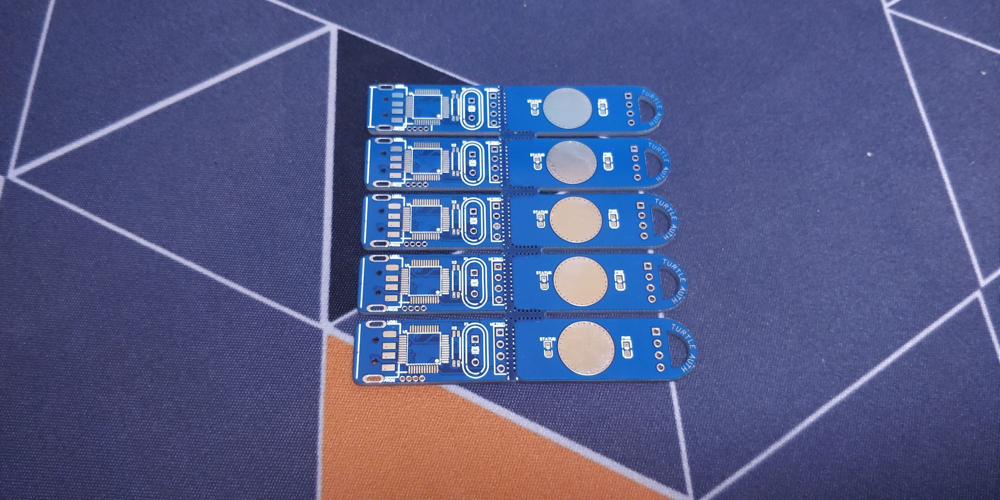
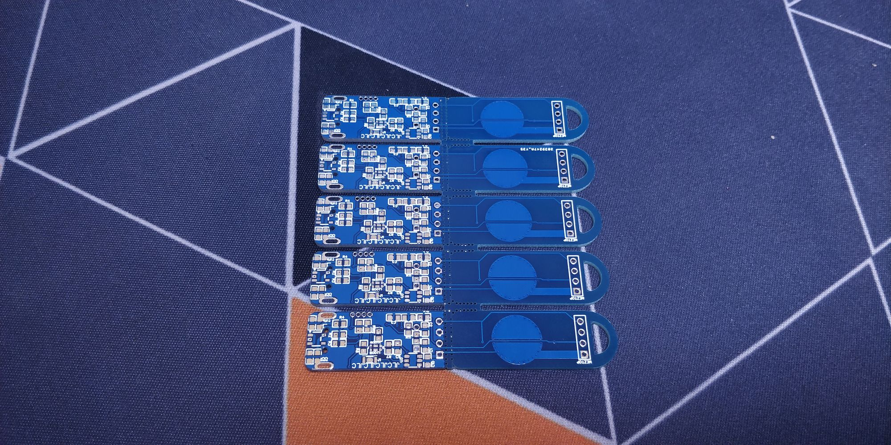
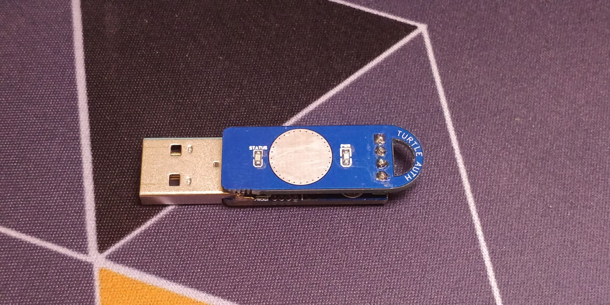
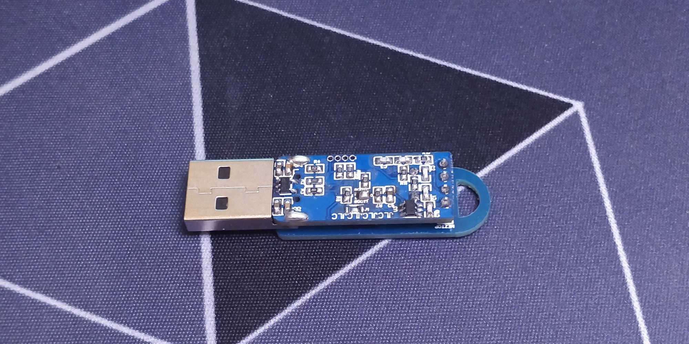
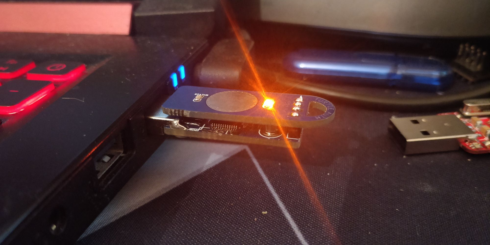

Some of you may know that you can use yubikey's as a gpg smart card for message encryption / ssh login however starting at $45 for a compatible one I didn't really like that, so I searched a bit to make a DIY one.

<!--more-->

Turns out, there is a project by [danman](https://blog.danman.eu/2-usb-crypto-token-for-use-with-gpg-and-ssh/) creating such token with a St link V2 (the stm32/8 programmer) after looking a bit I found out that there is the gnuk project that implements just that on a stm32f103.

## Testing

I, next found that there is another gpg key called the Nitro Key which is cheaper but still a bit pricey. As I already had some Blue pills (stm32f103 devboard) lying around I decided to test it.

I started by finding the source code of gnuk (and the sub module chopstx) which was more difficult than I thought (Some git services were shut down), upon finding the source on GitLab I cloned it on my GitHub ([https://github.com/TheStaticTurtle/gnuk](https://github.com/TheStaticTurtle/gnuk)[https://github.com/TheStaticTurtle/chopstx/](https://github.com/TheStaticTurtle/chopstx/)).

I named my project TurtleAuth, so I started by just using the same config as the ST_DONGLE target since I don't plan on changing the MCU and the officials ones are based on the stm32f103c8 (clones are often the stm32f101 which doesn't officially have "USB capabilities" but can be used anyway somehow). I proceed by creating my own board definition (chopstx/board/turtle-auth.h) and adding / changing configuration like the led pin which I set to PA13 (On board led on the bluepill) and configuring a button on PA8 in pull up

```c
/*
 * Port A setup.
 * PA11 - Push Pull output 10MHz 0 default (until USB enabled) (USBDM)
 * PA12 - Push Pull output 10MHz 0 default (until USB enabled) (USBDP)
 *
 * Port C setup.
 * PC13 - Push pull output 50MHz (LED 1:ON 0:OFF)
 * ------------------------ Default
 * PAx  - input with pull-up
 * PCx  - input with pull-up
 */
#define VAL_GPIO_USB_ODR            0xFFFFE6FF
#define VAL_GPIO_USB_CRL            0x88888888      /*  PA7...PA0 */
#define VAL_GPIO_USB_CRH            0x88811888      /* PA15...PA8 */
    
#define VAL_GPIO_OTHER_ODR          VAL_GPIO_USB_ODR
#define VAL_GPIO_OTHER_CRL          VAL_GPIO_USB_CRL
#define VAL_GPIO_OTHER_CRH          VAL_GPIO_USB_CRH

#define VAL_GPIO_LED_ODR            0xFFFFFFFF
#define VAL_GPIO_LED_CRL            0x88888888      /*  PC7...PC0 */
#define VAL_GPIO_LED_CRH            0x88388888      /* PC15...PC8 */
```

The button will still not work with this code I still had to add it the gnuk / chopstx source code. First I need to add a new function in chopstx to wait until the button has been pressed. I set it up to blink the led every 100ms and break out of the loop if the button goes high (I have a 10k pull down resistor on the button)
```c
void wait_button() {
    #if defined(GPIO_BUTTON_PIN)
        while (1){
            set_led(1);
            wait(1000000);
            if( (GPIO_OTHER->IDR & (1 << GPIO_BUTTON_PIN)) ) break;
    
            set_led(0);
            wait(1000000);
            if( (GPIO_OTHER->IDR & (1 << GPIO_BUTTON_PIN)) ) break;
        }
    #endif
}
```

Next I added the wait button function in the openpgp.c file at line 936 and 1144
```
#ifdef CONFIRM_BUTTON_SUPPORT
  wait_button();
#endif
```  

([https://github.com/TheStaticTurtle/gnuk/search?q=wait_button&unscoped_q=wait_button](https://github.com/TheStaticTurtle/gnuk/search?q=wait_button&amp;unscoped_q=wait_button))

and added the CONFIRM_BUTTON_SUPPORT option to the command line arguments ([https://github.com/TheStaticTurtle/gnuk/search?q=CONFIRM_BUTTON_SUPPORT&unscoped_q=CONFIRM_BUTTON_SUPPORT](https://github.com/TheStaticTurtle/gnuk/search?q=CONFIRM_BUTTON_SUPPORT&amp;unscoped_q=CONFIRM_BUTTON_SUPPORT))

Since I didn't have any experience programming and stm32 outside the Arduino environment I followed danman guide to build and transfer the program.

I started by creating a config for OpenOCD (Debugger / Programmer) and setting up to use a st link V2 to flash the software.

    #daemon configuration
    telnet_port 4444
    gdb_port 3333
    
    #interface
    interface hla
    hla_layout stlink
    hla_device_desc "ST-LINK/V2"
    hla_vid_pid 0x0483 0x3748
    
    #transport select swd
    
    # The chip has 64KB sram
    set WORKAREASIZE 0x10000
    
    source [find target/stm32f1x.cfg]
    #adapter_khz 100
    gdb_breakpoint_override hard
    

OpenOCD open a telnet server on port 4444 that you can use to send commands to it. I, next wrote a build and flash script to simplify my life during testing, since I change the source code on a different computer that the one I used to flash (Windows/Linux), I added git pull to make sure that I'm up to date with my GitHub

Build script:

    cd gnuk
    git pull
    git submodule update --init
    git submodule sync
    git submodule update --remote
    
    cd chopstx
    git pull origin master
    cd ..
    
    cd src
    ./configure --vidpid=234b:0000 --target=TURTLE_AUTH --enable-confirm-button
    make clean
    make
    

Flash script (Not the best but it works):

    echo 'stm32f1x unlock 0' > tmp.network
    echo 'reset halt' >> tmp.network
    echo 'stm32f1x unlock 0' >> tmp.network
    echo 'reset halt' >> tmp.network
    echo 'flash erase_sector 0 0 127' >> tmp.network
    echo 'flash write_bank 0 ./gnuk/src/build/gnuk.bin 0' >> tmp.network
    echo 'reset' >> tmp.network
    echo 'exit' >> tmp.network
    
    cat tmp.network | netcat 127.0.0.1 4444
    rm tmp.network
    

So after flashing sucess the device show up in dmseg

    [  808.561960] usb 2-1: Product: Gnuk Token
    [  808.561964] usb 2-1: Manufacturer: Free Software Initiative of Japan
    [  808.561967] usb 2-1: SerialNumber: TURTLE-1.2.15-87033357
    

After executing gpg --card-status I was greeted by a wonderful output that told me that everything was working correctly

    $ gpg --card-status
    
    Reader ...........: 234B:0000:TURTLE-1.2.15-87033357:0
    Application ID ...: D276000124010200FFFE870333570000
    Version ..........: 2.0
    Manufacturer .....: unmanaged S/N range
    Serial number ....: 87033357
    Name of cardholder: [not set]
    Language prefs ...: [not set]
    Sex ..............: unspecified
    URL of public key : [not set]
    Login data .......: [not set]
    Signature PIN ....: forced
    Key attributes ...: rsa2048 rsa2048 rsa2048
    Max. PIN lengths .: 127 127 127
    PIN retry counter : 3 3 3
    Signature counter : 0
    Signature key ....: [none]
    Encryption key....: [none]
    Authentication key: [none]
    General key info..: [none]
    

After that I could use it like a normal gpg smart card. However, this mess isn't superb to carry around and very fragile:

## Making it cooler

So I decided to improve my by design and soldering skill by only choosing 0603 sized components (Which is retrospect a size that I won't go further unless I get a magnifying glass or a microscope).

I wanted to have to boards one on top of each other to clean up the design and make it appear less "hacky" and I recently discovered the TTP223E Touch control ic, so I don't wanted to use a typical pushbutton to validate the access. So I basically cloned the blue pill design and added the ic:

I replaced the BOOT0/1 header with tiny pads that you solder to change the position, the USB connector to a USB A male one , I also tried to solder a metal dome for the reset button but that was a TOTAL failure of course I chose LCSC as my component provider (Partly for the shipping discount when you order via JLCPCB) and here is the [BOM list](https://data.thestaticturtle.fr/ShareX/BOM_Stm32GPG_2020-06-08_03-15-35.csv) the PCB design was by far the most challenging one that I did since I tried to do my best to reduce the board size (which cause me some problem during assembly later) at the end I submitted a panelized version of this board:

The bottom and top board are connected to allow me to test everything without the top board being in the way. After finally receiving my PCB from JLCPCB I snapped on board out and started soldering

And you can probably see the big mistake that I made, the USB is too far in and interferes with the board (I should really get the real 3d Model) a bit of surgery fixes that. As it turns out gunk doesn't need the 32.768kHz oscillator, so I didn't solder it but left the pads is I ever want to repurpose the board in the future. After a painful soldering session this was the result and I'm very happy with it:

Links

- [https://github.com/TheStaticTurtle/chopstx/](https://github.com/TheStaticTurtle/chopstx/)
- [https://github.com/TheStaticTurtle/gnuk/](https://github.com/TheStaticTurtle/gnuk/)
- [https://blog.danman.eu/2-usb-crypto-token-for-use-with-gpg-and-ssh/](https://blog.danman.eu/2-usb-crypto-token-for-use-with-gpg-and-ssh/)
- [https://www.fsij.org/doc-gnuk/](https://www.fsij.org/doc-gnuk/)
- [https://salsa.debian.org/gnuk-team/gnuk/gnuk](https://salsa.debian.org/gnuk-team/gnuk/gnuk)
- [https://salsa.debian.org/gnuk-team/chopstx/chopstx](https://salsa.debian.org/gnuk-team/chopstx/chopstx)
