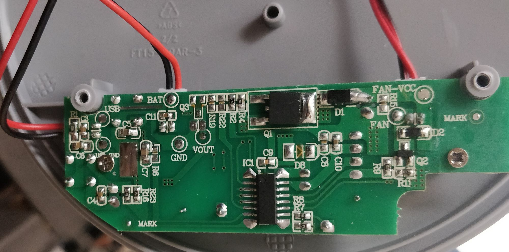
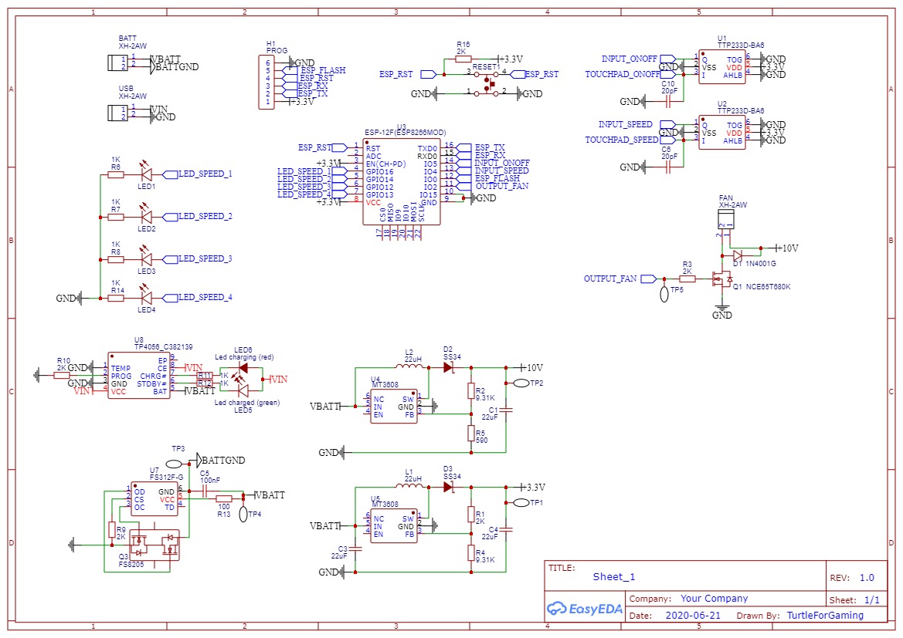
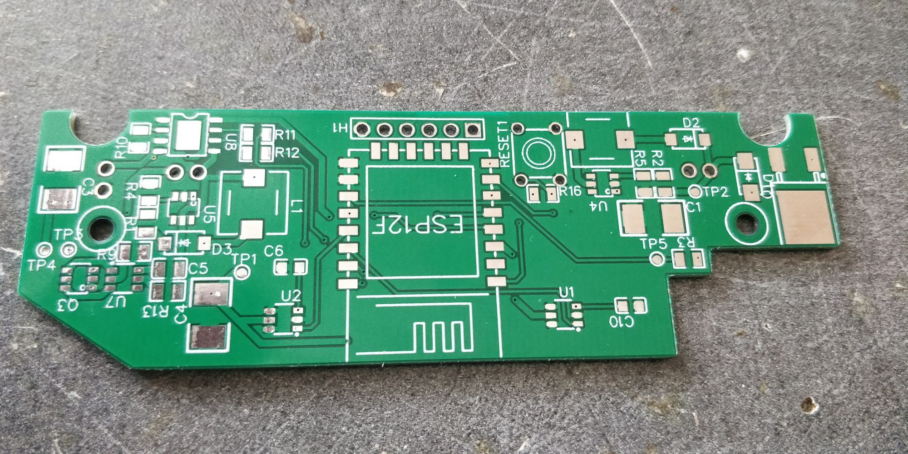
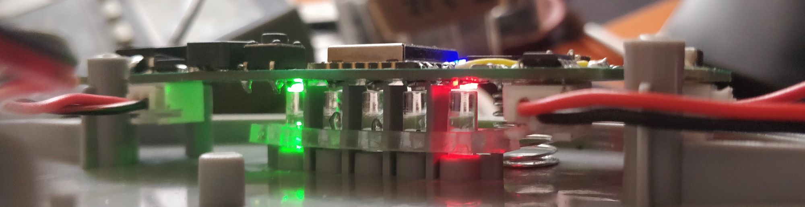
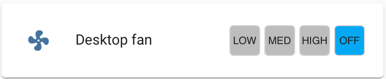

A while ago someone bought me a little table fan. In summer that's the best thing ever however it lacks a main requirement to be on my desk: It doesn't have any kind of connectivity. 

<!--more-->

After a bit of deliberation in my head I was fixed on adding an esp8266 and tho Wi-Fi capabilities. It was the best option to have ota updates and some functionalities and enough space to fit all that.

So I started by "reverse engineering" the original board, it uses two touch input to turn on/off and control speed, it has 4 speed indicators led and a charged/charging led. The fan motor is running on ~8.5V but tolerate 10V well and probably uses PWM to control speed. Unfortunately as for any Chinese product all the ICs are blank/scratched. The fan can run on one Li-ion battery (Probably a cheap ass 18650)

## The making

### Schematic

So I fired up Easy EDA and created this schematic, I basically ripped of Great Scott charge boost converter circuit added a second boost converter to get 10V and 3.3V (After adjusting the values of course). I used the same touch sensor that I used in my TurtleAuth project (The TTP233D) and used the premade ESP-12F module, all the IO just fit on the esp module (With an overlapping for IO2)

### PCB

The PCB design was pretty straight forward but the main issue was recreating the board size from the original manufacturer 

At the end, the two screw hole ended up to be somewhat in the right place and I needed to cut a bit of the PCB to make some place for the posts. In also needed to flip the LEDs 180 to align them with the light pipes.

The schematic called for a 20pF capacitor for the touch sensing, however after placing the pcb into the case the sensitivity was way too low it wasn't getting detected at all, so I tried a ~3pF cap and it somewhat worked but what worked the best was just no caps at all.

I also did a design mistake by putting a 3.3v boost converter on a 4v power supply, (ironic heh) so I desoldered the components necessaries to this rail and bodge an AMS1117-3.3 and it works really well.

The protection IC was a nightmare, there was no orientation marker that I could see (both for the mosfet and the ic). What threw me off a lot is that by just plugging the battery the protection circuit doesn't allow the current to pass, it turns out that you need to plug the charger after plugging the battery to trigger the ic and kick off the power supplys.

Another design "mistake" is that I forgot to tie the enable line to the input line of the boost converter IC. Thanks to the IC designer that put the pins next to each others and I just soldered the two pins together.

The final problem that I encountered is that I choose a mosfet that trigger at a voltage too high (stupid me that didn't read the data sheet) so after digging a lot in my part tray I found an old IRFZ44N which is bigger than the one originally choose so you can see it a bit (there is a 1 mm gap that means the enclosure doesn't close properly), but this mosfet works great now

At the end of two days of debugging / re-soldering / bodging, the assembled pcb looked like this:

## The software

### Arduino code

I tried to reproduce the original behavior has much a possible (One button increment the speed and on turn on and off the fan) and it works pretty great

The esp8266 connects to my Wi-Fi and my mqtt server for the home assistant integration. It also has OTA update functionality because it's just annoying to unscrew everything just to update something (and it's cool to say "BRB Just have to update my fan")

Code (And schematic+pcb without correction) on github:



### Home assistant integration

The home assistant component was done via the fan component using the mqtt integration, unfortunately home assistant only support 3speed (my fan has 4) so I just skipped the max speed and only used the low medium and high which is sufficient.

Thanks to hacs and custom lovelace integration I managed to find a good-looking card for the ui 

All in all it works pretty great and more a challenge to IoT everything than to actually make something useful out of it.

There is still a few bugs like pressing the change speed button will crash the esp (which is not that bad it replaces the reset button inside the enclosure). I would really like to find a suitable high frequency mosfet to remove the annoying pwm frequency at higher speeds (Plus the boost converter make some noise, but it's inside and only make noise under load so it's ok). Finally, having the 4th speed on home assistant would be nice to have
