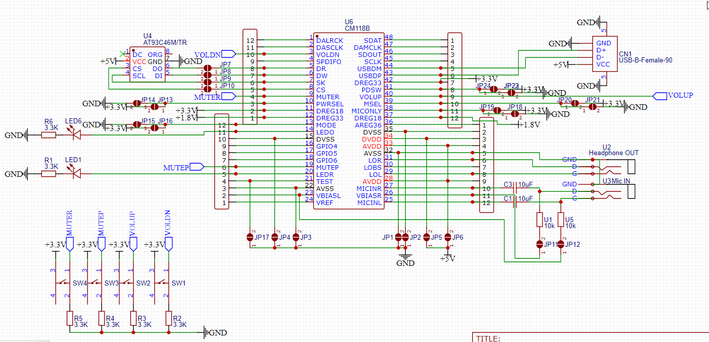
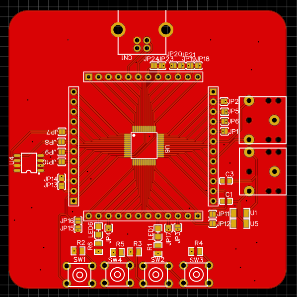
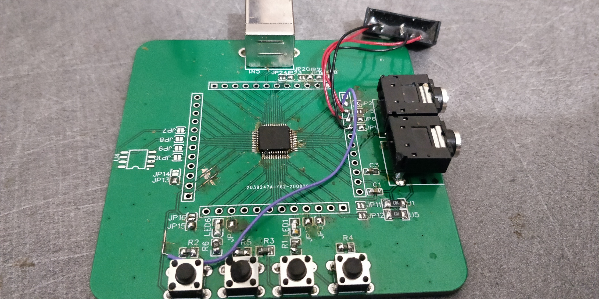

Needed USB audio input for my audio matrix. There wasn't an evaluation kit available, so I made one

<!--more-->

In my everlasting quest to make a good audio matrix I wanted to add USB support for one or two modules.

After some quick searches I found the company CMedia that produces ICs that goes into sound cards, perfect. I had quite a few requirements:

- Stereo OUT and IN
- Easy-ish to implement
- Possibility to chnage the displayed device name (And why not the VIDs/PIDs)
- **Cheap-ish**

After comparing option I settled for the CM118B which met all the requirement and was available on LCSC. I first search for other hobbyist project using this chip and didn't found one so I had no idea how to get it working.

Sometimes chips companies will sell evaluation board to test the ic and figure things out. Unfortunately it wasn't the case here, so I created a project in EasyEDA, placed the IC and put test pads on every pin that was used for configuration (+some power ones) the configuration pins are these:
Pin #Symbol10PWRSEL13MODE38MICONLY39MSEL
At the end the schematic looked like this: (If you look closely you'll spot the mistake)

After waiting one week and after starting to solder everything up I realized that I swapped the 1.8v and 3.3v lines (pin 12/13) after cutting the line and and soldering the right pads on the second 1.8v and 3.3v outputs it still didn't work.

Remember that at the time I thought that that was the only mistake so that why I went on and soldered the ic in place. Oh, boy I should have double-checked. See the traces underneath the ic ? See how they are connecting to pin ( 12 / 13 / 36 / 37) ? Well those pins are 1.8v / 3.3v / 3.6v / 1.8v and the 12 (3.3v) is connected to 37 (1.8v) so the IC wasn't gonna work shorting 3.3v to 1.8v.

Unfortunately I don't have a hot air station yet, so I had to make a tool out of copper wire to heat up all the pads at once. After that I managed to cut the traces and re-solder the ic.

Kudos to CMedia cause the IC survived at ~400°C for more than 5min and an internal regulator shorted to another one. After fixing everything my board was detected by my computer. After spending 15min trying to set the config pads correctly and messing a bit with the buttons everything worked sound was coming out and with some more messing with the mute button sound was coming in.

Things still on the to-do list is eliminating the annoying high-pitched buzz a low volume (It probably needs some isolation and probably another PCB maybe with an external i2s DAC/ADC maybe a whole other chip) and the last thing to do is program the EEPROM to set some other config bit that aren't accessible by physical pins (For example the display name that I will probably change to something like "AudioMatrix #1 Input/Output")

At the end the PCB looked like this (minus the EEPROM + some power supply isolation tests):

