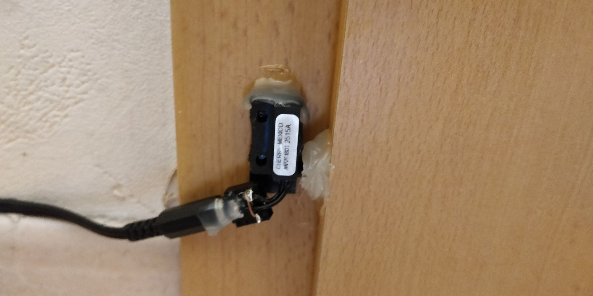
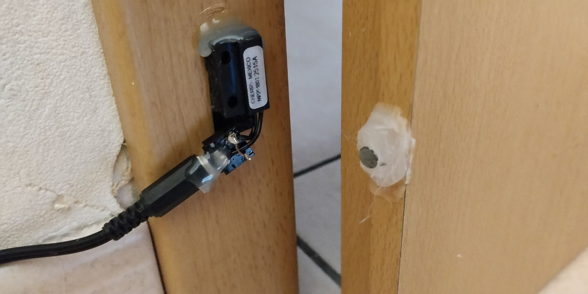
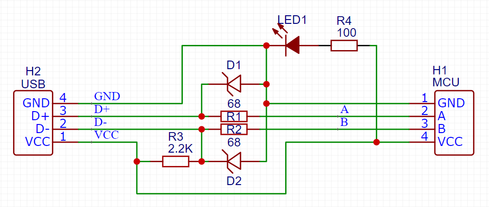
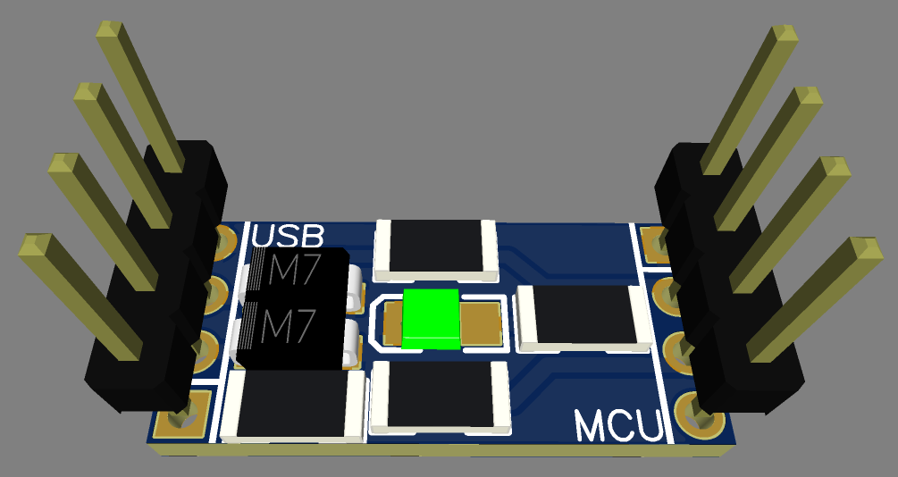
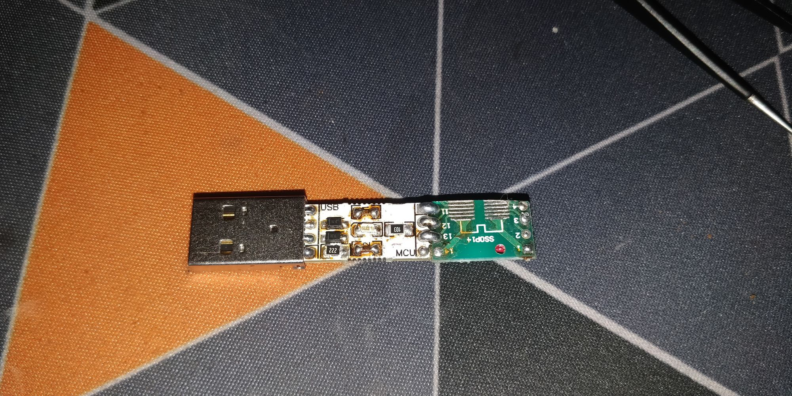
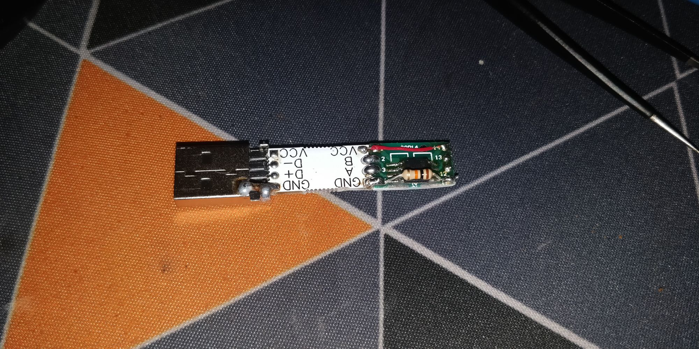
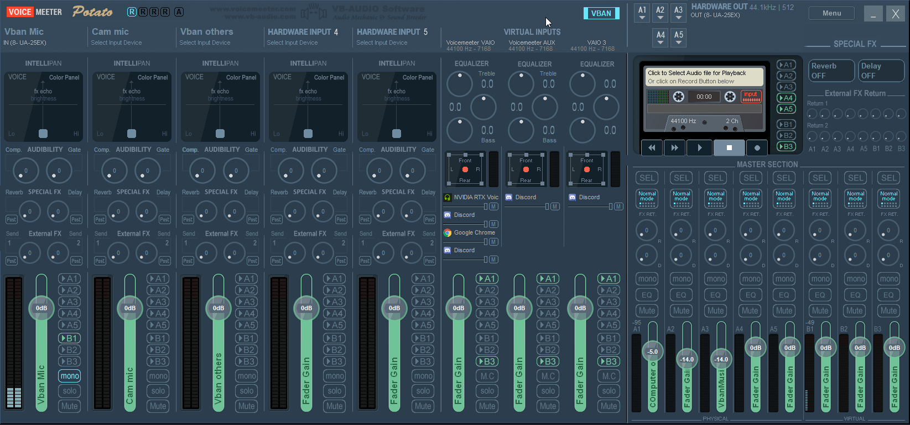
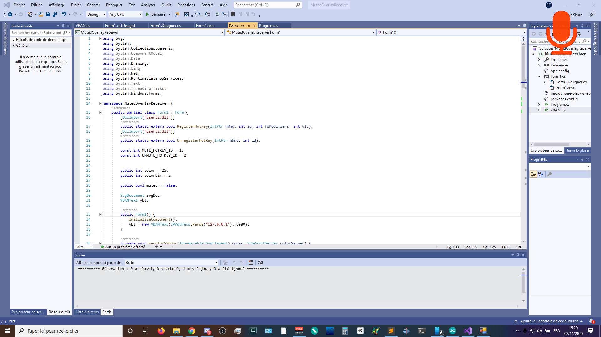

Making my door automatically mute me when it gets open so that I don't disturb my classes

<!--more-->

A few days ago the French government announced a lockdown, universities had to close and do their classes online.

As I live with my family, even if I have a room to myself my parent sometimes barges in saying something thing like "Do you want some pie" while I'm unmuted and in class, last night I had enough, so I made this project.

## Hardware

After some reflexion I choose to use and Attiny85 with the digispark bootloader, a very long 2pin(actually 3) cable and magnetic sensor.

First I managed to stick the sensor to my door:

It's not very pretty but it works well enough.

Next was the attiny, unfortunately I couldn't find an original digispark, so I used one of my V-USB breakout

And a sop-8 breakout board cut to only have the 4 pins on each side. Fortunately the soldering was very simple, after adding a pull down resistor and soldering a 3.5 mm jack between PB0 and +5V the electronics side was finished:

## Software

First I want to say that I use VoiceMeeter Patato to route my audio, as I use two computers with the mouse synced (See synergy) I also used Voicemeeter VBAN protocol to stream audio in real time between the computers

I didn't to just have the digispark act as a serial port, so I choose the keys combo CTRL + ALT +F2 to mute myself and CTRL + ALT +F3 to unmute. So all in all the attiny code is very tiny

    #include "DigiKeyboard.h"
    
    void setup() {
      pinMode(PB0,INPUT);
    }
    
    void loop() {
      DigiKeyboard.delay(5);
      if(!digitalRead(PB0)) {
        DigiKeyboard.sendKeyStroke(0);
        DigiKeyboard.sendKeyStroke(KEY_F2, MOD_ALT_LEFT | MOD_CONTROL_LEFT);
        while(!digitalRead(PB0)) { DigiKeyboard.delay(50); }
        DigiKeyboard.sendKeyStroke(KEY_F3, MOD_ALT_LEFT | MOD_CONTROL_LEFT);
      }
    }
    

Next was the software on the computer I could easily just have bound the keys onto VoiceMeeter and call it a day but I wanted to have an indicator of when the switch was muting my mic

The VB-AUDIO software is fantastic, like realy wonderful. It can be controlled via keystrokes but also via the VBAN Text sub-protocol (See the full documentation here [https://www.vb-audio.com/Voicemeeter/VBANProtocol_Specifications.pdf](https://www.vb-audio.com/Voicemeeter/VBANProtocol_Specifications.pdf)). So instead of send keystrokes everywhere and preventing me to write on the computer I decided to use the sub-protocol

As I suck in making "art" I took a microphone SVG from flaticon ([here](https://www.flaticon.com/free-icon/microphone-black-shape_25682?term=mic&amp;page=1&amp;position=2)).

First I sized and colored the window correctly, load the svg, register the key bindings and add an exit menu:

    private void Form1_Load(object sender, EventArgs e) {
    	this.TransparencyKey = (BackColor);
    	svgImage.Location = new Point(0, 0);
    	this.Size = svgImage.Size;
    
    	svgDoc = SvgDocument.Open("C:\\Users\\tugle\\Downloads\\microphone-black-shape.svg");
    	recolorSVGDoc(svgDoc.Descendants(), new SvgColourServer(Color.FromArgb(255, 255, 64, 0)));
    	svgImage.Image = svgDoc.Draw();
    	timer1.Enabled = true;
    
    	// ALT+CTRL = 1 + 2 = 3 , CTRL+SHIFT = 2 + 4 = 6...
    	RegisterHotKey(this.Handle,   MUTE_HOTKEY_ID, 3, (int)Keys.F2); ;
    	RegisterHotKey(this.Handle, UNMUTE_HOTKEY_ID, 3, (int)Keys.F3); ;
    
    	this.notifyIcon1.ContextMenuStrip = new System.Windows.Forms.ContextMenuStrip();
    	this.notifyIcon1.ContextMenuStrip.Items.Add("Exit", null, this.MenuExit_Click);
    }
    

While the `muted` variable is true the windows is constantly set to visible and set to the TopMost window (in front of every other one), this varaiable is also linked to a timer that makes the opacity of the window fade to add some style

Next I made these function that are executed when I want the program to mute/unmute me 

    void oneShotMute() {
    	Console.WriteLine("MUTE");
    	muted = true;
    	vbt.send("Strip(0).Mute = 1");
    }
    void oneShotUnMute() {
    	Console.WriteLine("UNMUTE");
    	muted = false;
    	vbt.send("Strip(0).Mute = 0");
    }
    

As my mic is on the first VoiceMeter input the correct command to send is `Strip(0).Mute = x`

The vbt variable is an instance of the VBAN Text class that I made. Since I don't need things to be flexible with this app I hard coded the values like the stream name and skipped any security checks like the command length which has a maximum length and the end the function looks like this

    public void send(String text) {
    	char[] send_buffer = {
    		'V','B','A','N',
    		(char)0x40,
    		(char)0x00,
    		(char)0x00,
    		(char)0x01,
    		'C','o','m','m','a','n','d','1','\0','\0','\0','\0','\0','\0','\0','\0',
    		'\0','\0','\0','\0'
    	};
    
    	sock.SendTo(
    		Encoding.ASCII.GetBytes(
    			((new string(send_buffer)) + text).ToCharArray()
    		)
    	, endPoint);
    }
    

After a lot of coding to make sure that I could move the icon by dragging it arround the screen and that everything worked as it was supposed to I clicked generate and it was done. Here is what it looks like:

## Conclusion
True, I could have just used an esp8266 to send the UDP packet to VoiceMetter but I like using wires. Now the only issue that I have is since I share my keyboard using synergy between my computers my cursor is on my second computer the keystrokes aren't registered on my app and only sent to my second computer (which in itself is a good thing) so I'll need to write a patch for that.

As always here's the code (might differ from the article):



## Video
Quick demo video:

