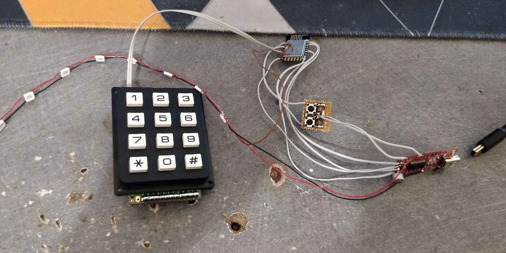
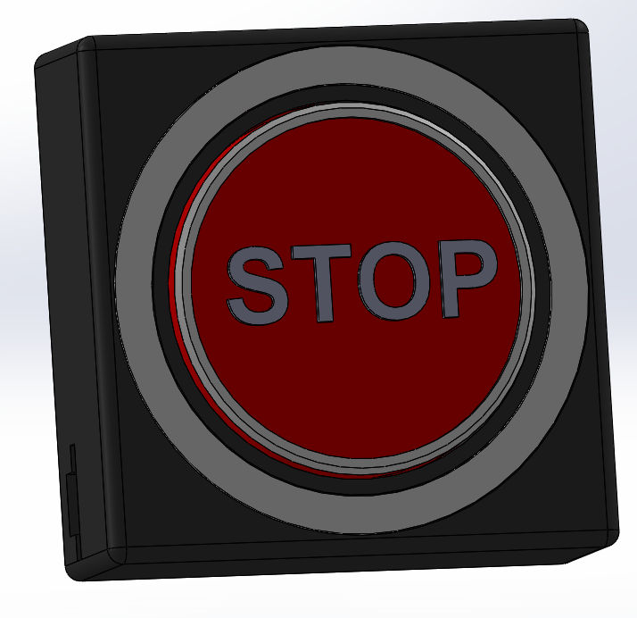

Using the freebox API to control a profile internet access with a big red button to toggle it (Oh and also rgb)

<!--more-->

For a while now I wanted to have a button that I could use to mainly troll my little brother while he's gaming. 

There are multiple ways to go about it, I could implement an arpspoof to change the gateway address, or I could go the much easier way and just use the router from my ISP (Freebox from Free) API to control a profile internet access's.

First the freebox API documentation sucks first link you get when you google it is [https://dev.freebox.fr/sdk/os/](https://dev.freebox.fr/sdk/os/) however, this is the v4 documentation and mine uses v8. Following the v4 worked great until I had to actually control the status and not just monitor it. After many hours of searching, the latest documentation can be found in the help menu on the configuration interface.

Otherwise, using the api was really straight forward, maybe the login part was a little confusing but apart that it was all good.

Next I need to put all this on an esp8266, as I did all the testing with python and never tried using micropython, I flashed it on the esp and started porting the python test code. 

And it went downhill from there. To simplify things I removed the "acquire app token" part and add a variable for it. 

To get a session token, you need to get a challenge and do an hmac-sha1 with it and the token. And after many hours of trying, the micropython hmac, hashlib, uhashlib were not able to give me a hmac. After these painful hours I just gave up and searched for a pure python sha1 implementation and after copying some part of hmac and fixing missing functions I had it working nicely.

After all that it wasn't really difficult, add prints everywhere, add the ws2812 for the status indication and add the button.

But I couldn't really leave this mess hanging around (I use the keypad as one big button, useless otherwise as it isn't a matrix).

So after some time I managed to make a good enough box

After way to much time 3d printing and assembly I managed to fit everything nicely.


images/dl_IMG_20210101_014249.jpg
images/dl_IMG_20210101_024907.jpg
images/dl_IMG_20210101_024324.jpg
images/dl_IMG_20210101_024339.jpg
images/dl_IMG_20210101_024829.jpg


The ring get white/blue at boot while connecting to Wi-Fi, purplish while connection to the API and red/green depending on if the profile has internet access or not. Also, when you press the button the ring goes white while it does the request.

The parental control system is actually good for once, when a "pause" is scheduled, you can't have internet access and pressing the button can't turn it back on. When in normal operation, pressing the button will simply toggle the override of the interface.

I've also added a config file to disable the button if for example I switch the profile off and someone takes it they can't turn it back on without the router password

All in all the button works really well and could probably be used for something else than just for trolling my brother. Micropython was also a nice experience, but it's definitely not for the esp8266 during debugging I frequently had some unable to allocate memory, the esp32 however didn't have any issues. Micropython also lack a really good code editor because uPyCraft sucks compared to PyCharm or even VS Code

As always, here is the code I used (Also includes 3d models)


