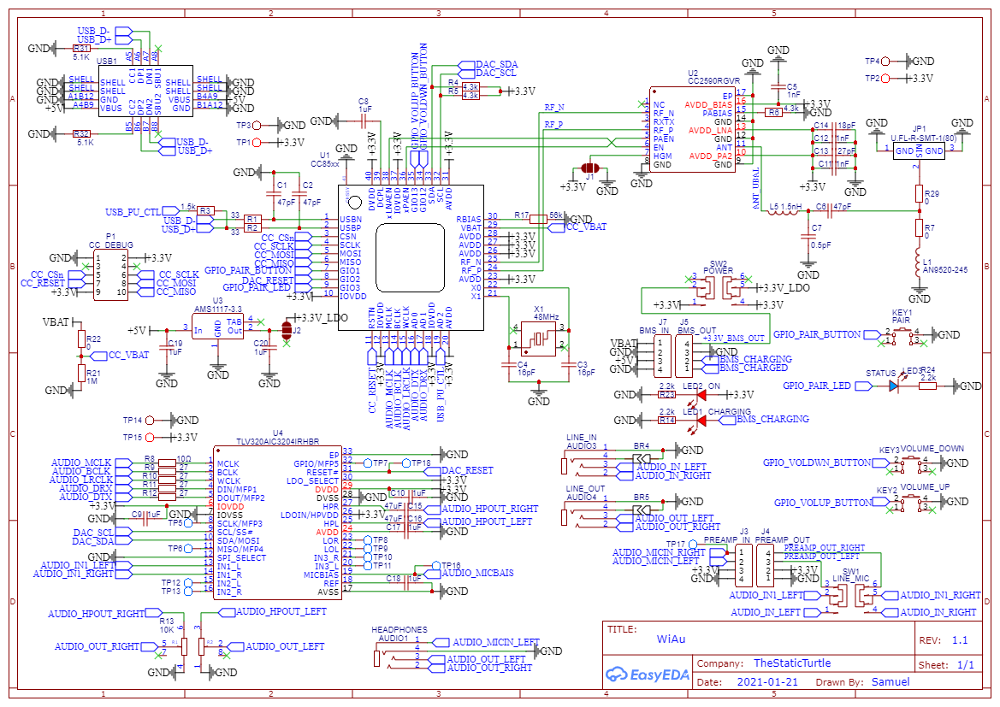
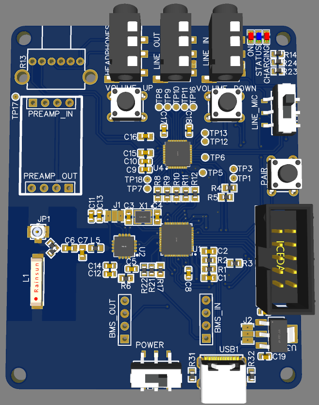

Second version of my CC85XX wireless audio transceiver prototype 

<!--more-->

A while ago I design the first prototype of my wireless audio system based on the CC85XX chip family from Text Instruments



The first prototype had a lot of issues but the most annoying one being that I couldn't go further than 1 meter I also had issues with the TLV320AIC3204 only working on the breakout board.

In the post I said that I was redesigning a schematic and a PCB, the truth is that I actually had one ready before I published the post. I spent way too much time re-reading datasheets of all core part: the CC8531, the CC5920 and the TLV320AIC3204. 

The only reason I didn't manufacture the board immediately is just in case I thought of a mistake later, and kinda forgot about it. Last month I placed an order for other PCBs and I add this one.

This PCB is pretty much the bare-bones, I removed the BMS and the mic preamp, I also paid a lot more attention to the capacitor placements and added resistors from the example schematics.

And out came this PCB:

After spending around 5h to assemble two of them, here is the result:

I've tested it for +24h and if I stay "close" (1/2 meters) to the transmitter it works fine without any dropouts, any more and the signal is weaker starts to drop out sometimes. Other issues of this version include: messed-up audio jack pins, no mic preamp, no BMS and minor issues with the rf part.

Next thing is to study a bit more on rf design and the cc2590, get the freaking jacks pinout right, and find better buttons for a potential case.

Hopefully the V3 will work first try without any major issues and a decent range.
