The very long story on how I setup LDAP authentication for my samba shares with ACLs on TrueNAS

<!--more-->

**Disclaimer: This is not a tutorial, just a lot of notes about how I setup SMB shares with LDAP auth on TrueNAS**

So with my new NAS I thought it might be nice to do things properly and have a centralized user system for all the other apps that I have. 

First thing that comes to mind is an AD there are a few issues with that:

- Windows server consumes a lot of ram, cost money and is quite frankly overkill for my home use right now. To solve this you have opensource and/or free stuff like zentyal or univention UCS (Which after testing work pretty well)
- Next to use it I need to either enter the domain name before the user (eg MYDOMAIN\user) or actually join the computer to the domain which is a big no no no for my current network (I would do it if I was setting everything for the first time)

Next I found FreeIPA which is pretty cool, and I probably could get it to work now but when I started last week I could not get it to work with the smb shares. This is one thing I might go back to and try again

## Installing OpenLDAP

So next I went to town and installed OpenLDAP this was the easy part this tutorial pretty much explains it all [https://computingforgeeks.com/install-and-configure-openldap-server-ubuntu/](https://computingforgeeks.com/install-and-configure-openldap-server-ubuntu/) . The main things are:

- Have a name for the ldap server and put it in the host files (I'm using fluffy.lan.xxxxxx.fr with 192.168.1.52)
- Install slapd and ldap-utils
- Add the base OUs (groups, people and machines)
- Don't create a user yet

### Yay, let's add SSL/TLS

So I don't know why it's need but somehow doesn't work without.

As I'm trying to set up a proper network, I didn't want to just generate certificates on the LDAP container and transfer them to machines on the network afterwards.

So I launched XCA and created a new DB, created a CA certificate/pkey combo and an TLS certificate/pkey for the LDAP server
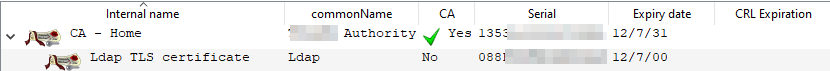
I then put the CA certificate and LDAP TLS certificate under /etc/ssl/certs/ and the LDAP TLS private key under /etc/ssl/private/

Then followed this tutorial [https://computingforgeeks.com/secure-ldap-server-with-ssl-tls-on-ubuntu/](https://computingforgeeks.com/secure-ldap-server-with-ssl-tls-on-ubuntu/) skipping the part about generating the certificates (start at step 2) and using the proper paths. 

I also added the certificates in **every **config file possible, added the ldaps:/// service in /etc/default/slapd

And it worked, yay

## Adding LDAP to TrueNAS

Adding LDAP auth was really easy, just pop in the hostname, base and bind DNs (+ the password) and that was it
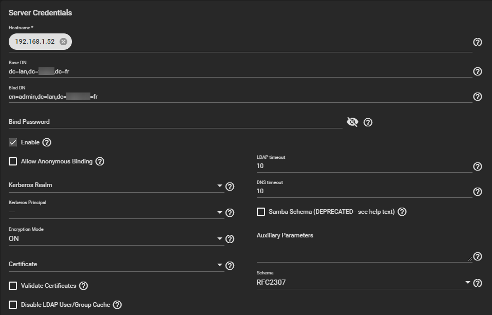
At this point, I had a test account on my LDAP server and was able to ssh to TrueNAS with this user

## Adding LDAP to samba

That's the tricky part, as there is so little documentation / forum post that you might as well say that there is none

After many hours of searching, I found this note in the truenas documentation:
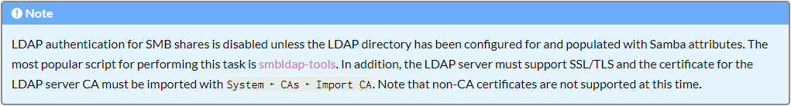
### Adding the samba attributes

Again, doing the [smbldap-tools](https://wiki.samba.org/index.php/4.1_smbldap-tools) is the tricky part. The Ubuntu tutorial is pretty good ([https://guide.ubuntu-fr.org/server/samba-ldap.html](https://guide.ubuntu-fr.org/server/samba-ldap.html)) a few things were different tho:

- The samba.ldif example file was not gzipped, and I could just pipe it to ldapadd
- You really can't mess up while doing smbldap-config:

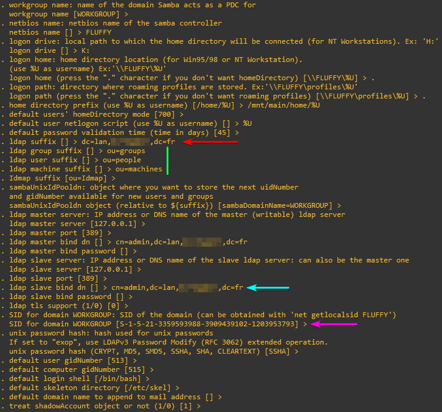
- LDAP Suffix is the base DN
- LDAP group/user/machine suffixes are the corresponding OUs when installing OpenLDAP.
- Master/Slave Bind DN is well the bind DN (I used the admin account)
- The default SID for the WORKGROUP domain will f*** you up later, but it's easy to change

The command smbldap-populate should work without any issues:
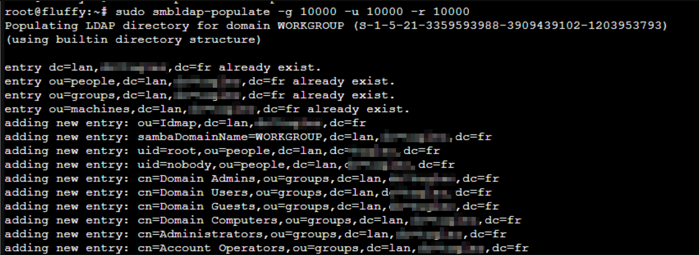
Then using an LDAP browser you should see the root and nobody users in the people OUs:
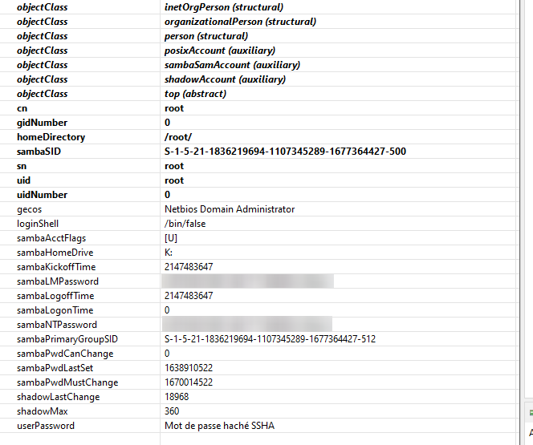
The most important part is the samba attributes, if they aren't there something is messed up

### Creating a user

It's actually really easy, you just' can't do it remotely in order to populate the samba fields:

`smbldap-useradd -a -d /mnt/main/home/my_user -N my_user -P -B 0 -s /bin/bash my_user `

### Logging in

Actually, using smbclient with a user in the LDAP does not work
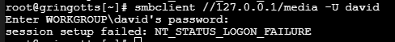
Turns out it didn't even find the user
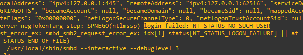
I thought that TrueNAS would automatically configure samba to use ldap what a naive mistake why the hell would something work when you activate it...

So after search for I while I figured out that you can either have local login or ldap login fine I guess but not ideal if the LDAP server fails.

To configure samba, I wrote this in the auxiliary parameters of the SMB service settings:

    passdb backend = ldapsam:ldap://192.168.1.52
    
    ldap admin dn = cn=admin,dc=lan,dc=xxxxxx,dc=fr
    ldap group suffix = ou=groups
    ldap machine suffix = ou=machines
    ldap passwd sync = yes
    ldap suffix = dc=lan,dc=xxxxxx,dc=fr
    ldap ssl = no
    ldap user suffix = ou=people
    
    idmap config * : range = 10000-39999
    ldapsam:trusted = yes
    idmap config * : backend = tdb
    

This translates to this full config


That was not the end tho because now using smbclient printed out this error:
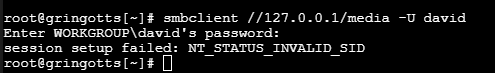
After starting smbd manually once again, this was the actual error:

`The primary group domain sid(S-1-5-21-1836219694-1107345289-1677364427-513) does not match the domain sid(S-1-5-21-3359593988-3909439102-1203953793) for david(S-1-5-21-3359593988-3909439102-1203953793-10004)`

When I think about it, the domain SID is clearly wrong, and it's using the SID from the FLUFFY domain instead of the actual one, so I got the sid for it and modified every ldap entry (groups included) by replacing `S-1-5-21-3359593988-3909439102-1203953793` (fluffy) to `S-1-5-21-1836219694-1107345289-1677364427` (which is the value that worked for me).

Then as a good measure I also modified the SID= in the /etc/smbldap-tools/smbldap.conf file

Next came a lof of joy:
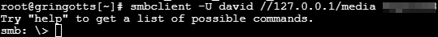
It actually worked and sure enough it mounted just fine 
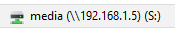
### Groups and ACLs

So right now I have two shares, the home one and the media one (containing photos and videos, probably audio at some point)

To start, I created a few groups with smbldap-groupadd and reorganized them.
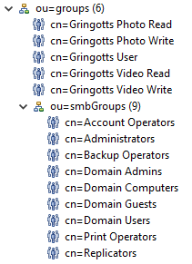
Then I edited all the ACLs on TrueNAS to look like this:

/mnt/main/home

    User: root
    Group: Gringotts User
    
    ACLs:
    @group ALLOW Traverse
    @owner ALLOW Full
    

/mnt/main/media

    User: root
    Group: Gringotts User
    
    ACLs:
    @group ALLOW Read
    @owner ALLOW Full
    

/mnt/main/media/photo

    User: root
    Group: Gringotts User
    
    ACLs:
    @owner ALLOW Full
    "Gringotts Photo Read" ALLOW Read
    "Gringotts Photo Write" ALLOW Full
    

/mnt/main/media/video

    User: root
    Group: Gringotts User
    
    ACLs:
    @owner ALLOW Full
    "Gringotts Video Read" ALLOW Read
    "Gringotts Video Write" ALLOW Full
    

These ACLs only allow access to members of the "Gringotts User" group to the shares and granularly the Read/Write permissions for the video and photo dataset

**Note: **I did have to restart smbd on TrueNAS manually to update the permissions

### 
Conclusion

I'm very happy on how it turned out, the LDAP is pretty easy to manage and sync-up pretty fast. There are a few things that could be better / will do next:

- If I had to set up a network from scratch, I would have gone with an AD and joined every computer because it's much easier
- Setting up LDAP for samba sucks and is really annoying to do
- I need to code an interface for managing users easily because LdapAccountManager only somewhat works
- I'm going to make 3 backups of this container because it was so annoying to do

### Resources

Main resources / websites used for this setup:

- [https://computingforgeeks.com/install-and-configure-openldap-server-ubuntu/](https://computingforgeeks.com/install-and-configure-openldap-server-ubuntu/)
- [https://www.ixsystems.com/documentation/truenas/11.1/directoryservice.html#ldap](https://www.ixsystems.com/documentation/truenas/11.1/directoryservice.html#ldap)
- [https://guide.ubuntu-fr.org/server/samba-ldap.html](https://guide.ubuntu-fr.org/server/samba-ldap.html)
- Forum posts on truenas.com (couldn't find them)
