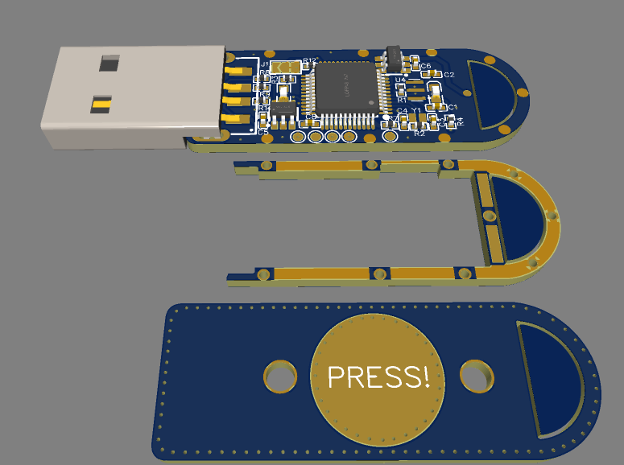
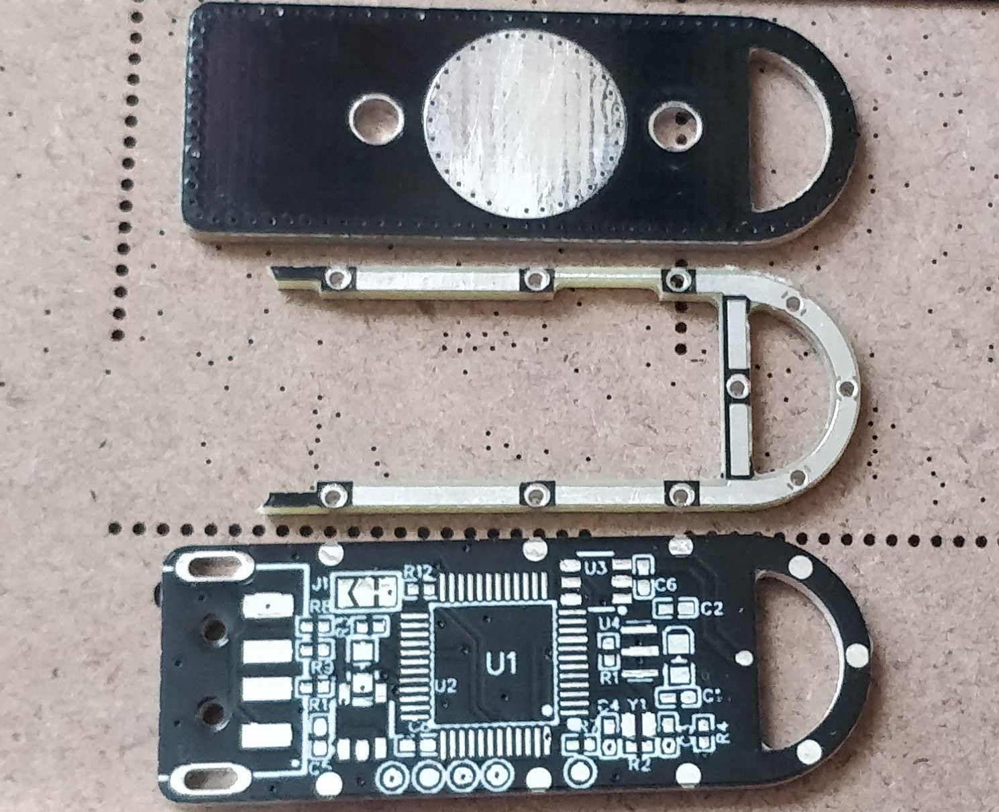
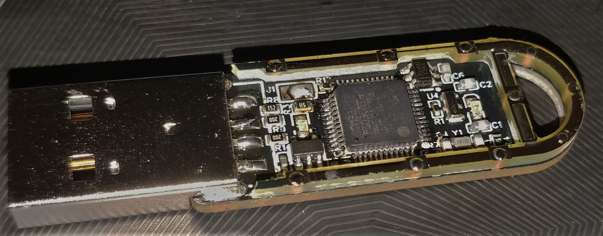
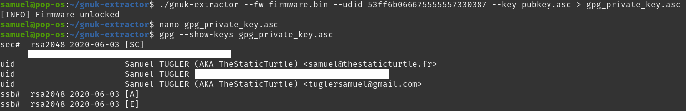

Making a updated and sturdier second version of TurtleAuth, my stm32 based GNUK and U2F tokens

<!--more-->

## Context

A while back, I created the TurtleAuth, this was a simple stm32f103 + USB connector on a stick. This allowed me to flash firmware like gnuk or stm32-uf2-token, which provided me with a hardware gpg key and uf2 key respectively.

However, I recently observed some issue that needed a 2nd revision and here we are.

## Why

So the issues are entirely with the hardware. I didn't have a single issue with the firmware part of the project (but I'll be touching it a bit later since I needed to somehow get the private key off the original keys)

After more than a year of using these keys daily, they started to show theirs weaknesses. In my [previous post](https://blog.thestaticturtle.fr/lets-make-a-diy-gpg-usb-key/), I stated that “the big mistake that I made, the USB is too far in and interferes with the board”. This became a problem after a few months because the USB broke, and I need to resolder it constantly.

With the old revision, I had put all the passives on the bottom side, this works great for a bench PCB which don't experience daily abuse. But on a keychain things are different, and I had to replace multiple capacitors / resistors that broke off.

These issues lead me to make the TurtleAuth 2.1 more resilient and fixed the previous issues.

### What's new

In this revision, I fixed the USB connector positioning and also reduced the component size.

For this reason (and also as a challenge to myself), I decided to go with 0402 components and I decided to try to put everything on the top side

Unless you live in a cave, you've heard of the component shortage. I'm one of the few who still has some stm32f103 in stock, so I didn't even bother to find out what I could replace it with because: 

	A) I don't want to pay for an IC right now
	B) I already have one.

This, however, poses a tiny issue that the stm32f103c8t6 is more than 2/3 the size of the width of the PCB.

As another challenge to myself, It thought, it would be cool to use the PCB itself as a case, a bit like the [Solo V2](https://www.kickstarter.com/projects/conorpatrick/solo-v2-safety-net-against-phishing).

Everything else is pretty much the same as the old version

## How

### Schematic

As I said before, the schematic isn't that different from the old version. A few things changed:

- I removed the BOOT1 selector as it was annoying to change and useless
- Used a bigger selector footprint for BOOT0
- Removed the headers for the old “top” PCB
- Changed the crystals (8MHz and 32k) to smaller ones
- Changed all the passives to 0402
- Added test points for the debug port

This gives a pretty good and small schematic for the new version:
Schematic of the TurtleAuth 2.1
### PCB

I took an interesting approach with the PCBs. Instead of make a 3d printed case that would add to the overall size of the key, I decided to layer 3 PCBs on top of each other, allowing for a very sturdy construction

The first PCB holds every component, as I'm making a case out of PCBs, I needed to put everything on the top side, this made for some very, intriguing design requirements.

First, since I needed a spacer between the top PCB and the bottom PCB, I had to leave around 1.5 mm of clearance on each side. I spaced some copper pads evenly on the bottom and middle PCB to allow putting a bit of solder in them and merge them together.

Next, with an area of around 22 mm by 10 mm, I had no choice but to go with 0402 components where possible. All passives are 0402 and the LEDs are 0603. I had to break a few best practice guidelines to make it fit, but in the end it all worked out.

### Soldering

Once again, [PCBway](https://www.pcbway.com/) stepped in and volunteered to sponsor the boards, thanks to them, I was able to make boards that need a pretty fine precision

After a week of shipping, I received 10 of each PCB and promptly inspected them for any defects. I was very pleased to see nothing wrong with every board, even the middle PCB which has a narrower part on one border (0.8 mm) were all intact

The board were truly amazing, and I'm very pleased with [pcbway](https://www.pcbway.com/) PCBs.

Now for the painful part of soldering the components. Now, I'm a bit of an idiot and didn't think to take a photo before soldering the second PCB in place

Turns out, I somehow messed up my order and accidentally ordered, 10050 sized capacitors, so I had to use 0603 caps for the oscillators and the TTP223. Not a big deal because smd caps footprint are generally a bit oversized, so I could solder them without an issue.

The real issue was the chipresistor shortage. It turns out that the 3 resistors I need for the USB part of the stm32 were delayed until September 2022 (so around 5 months later).

Nevertheless, I had some 0603 of these in stock, and it barely fits on the footprint, I was afraid that it wouldn't make a good contact, but it works without an itch.

The component were pretty easy to solder overall.

I then had to program the chip because the second PCB obstruct the debug port, these challenges will be detailed in the next part.

Soldering the middle PCB was actually pretty easy, I just had to flow solder in each pinhole and check that the solder went all the way down, the secret here is using a ton a flux. After I was sure that I soldered everything, I prepped it for the top PCB by tinning the exposed parts.

I then did the same for the top PCB and soldered them together, and that was the tricky part. I started by soldering the capacitive touch "trace" which was **very** annoying, it took well over 15 min to align everything  correctly and solder these two traces. Then, while adding some solder, I ran my soldering iron tip in the little groove between the top and middle PCB, this had the effect of creating a "solder" layer between the top and middle PCB. If I had to guess, this groove is around 0.5 mm high. It wasn't planned, but it added a superb, glossy accent to the aesthetic.


images/dl_IMG_20220410_003203.jpg
images/dl_IMG_20220410_003311.jpg
images/dl_IMG_20220410_003243.jpg
images/dl_IMG_20220410_003355.jpg
images/dl_IMG_20220410_003233.jpg


The last thing I did was to melt a tiny bit of hot glue on top of the LED holes, this acts a diffusing layer, making the final board look like a professional product


images/dl_IMG_20220410_003714-1.jpg
images/dl_IMG_20220410_003752-1.jpg


I tried my best with the photos, but it really doesn't make justice, it's so much better IRL.

### Programming

That was a whole story in itself. I wanted to re-use the same private keys so that I didn't have to swap the u2f of every account and more importantly that I didn't have to change my gpg certificate. As a bonus point, it also means that my old keys are now my backup keys, just in case something happen.

First I tackled the u2f token which easy, I simply needed to dump the flash of the old card and re flash it to the new one and bam it worked like a charm. That's one card done 

Next and final card is my GNUK token, this was different, dumping the firmware and re-flashing sort of worked. The private key was indeed present on the device but the user password and admin password didn't work, they are somehow linked to the chip itself. Not to worry, someone wrote a cool script to extract the private key provided that you have a dump of the flash and the ID of the chip, which I have:



I extracted the private key and was able to import it in my gpg keyring. I then proceeded to compile a fresh version of gnuk (I'll add that that was a nightmare because it was somehow missing libc, I fixed it by compiling on another machine) and flashed it to the board.

After this, I then transferred the 3 keys (authentication, signing, encryption) to the card itself and deleted it from my computer. After re-adopting the card, I could see that the key was indeed on the device. To finalize it I add the public infos like the cardholder name, public key URL, etc. Second card done.

After some testing, it seems that both card work correctly and authenticated me successfully everywhere 

## Conclusion

This project was a wonderful success, everything worked flawlessly, and I'm very happy with the result, I'm confident that this key is much more sturdy than the previous version

Doing this project really showed how easy someone could duplicate my u2f key. BUT this is NOT in my threat model. Right now, I'm not concerned that that going to steal my keys, de-solder it and dump the firmware0. If I ever need to have better security, I'll probably buy a certified key from a trusted vendor. But this is more than fine for home & homelab use.

### Future plans

I already thought of some improvement like making the card smaller somehow and maybe moving to the RP2040, bringing the price down even more. But that would mean a rewrite of the whole firmware, which isn't going to happen right now.

### Links





Again, thanks to [pcbway](https://www.pcbway.com/) for allowing me to use their services by sponsoring these PCBs.

