Let's make a completely overkill project to automate my skylight and integrate it with HomeAssistant. 

<!--more-->

Summer is here, and it's bringing the heat with it.
My bedroom is on the 1st floor and the 1st floor is where it gets really hot, some people can sleep when it's hot, I, however, can't.

Fortunately, I have a sleep schedule that some people call "messed up" however I prefer "non-traditional", so I can open my window at 23h and close it when I go to sleep at 02h30 and have my room relatively cool.

However, by the time I wake up, it's already much too hot, and I don't like it. I could leave the window open, but light wakes me up easily, and I want to avoid being woken up by the sun at 5h30

So instead of remembering to open the window every day, my maker mind went to the obvious solution, which was: let's start yet another completely overkill project to automate this thing to open and close automatically.

## Moving the window

As I said, my room is on the first floor and our house have a slanted roof, so I have a velux (skylight) that pivots on the top, like that:

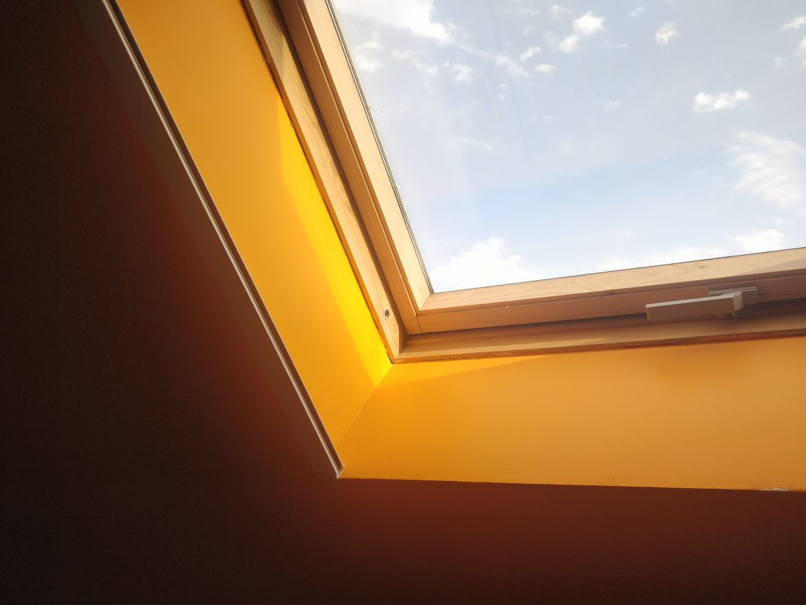


So, I foolishly bought a 40 cm linear actuator, thinking that I could fit it so that I would have a big range, that was a stupid idea, the damn thing wouldn't fit at all. Therefore, I returned it and bought a 20 cm one, which barely fit.
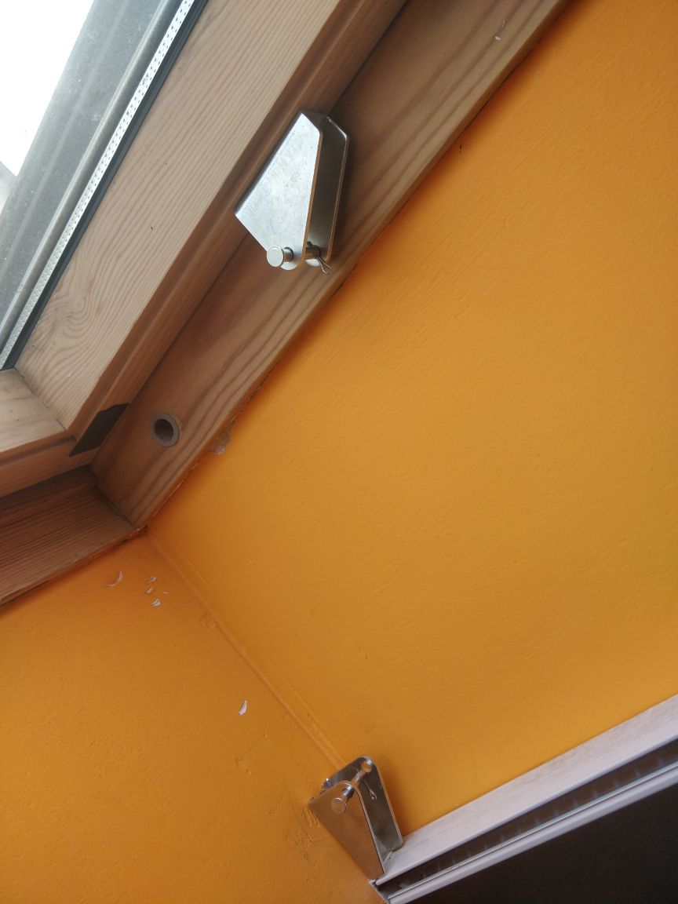


## Controlling the motor

After this was installed, I started working on the controller, this was a bit tricky.  The linear actuator has end stops that prevent it from going too far in or out. This is very useful to avoid the system breaking itself. 
But for me, it's even more useful because it helps to determine the state of the window. If I supply power to the actuator input, and it doesn't move, it means that it's either open or closed, which gives us this table:

| Motor supply | Motor running | Outcome |
|--------------|---------------|---------|
| +12v         | No            | Open    |
| +12v         | Yes           | Opening |
| -12v         | Yes           | Closing |
| -12v         | No            | Closed  |
|              | No            | Stopped |
|              | Yes           | Problem :rofl: |

Now, how can we detect if the motor is running? The first thing I thought of was to use a current sensor and as a bonus, I would be able to test if the motor stalls, there are, however, multiple issues with this:
 - Couldn't get the damn sensor to appear on an i2c scanner  :angry: (probably broken, I ordered another one)
 - The actuator I got is using a lead screw and apparently have 750 N of force, which would rip out the drywall screws way before any current sensing would detect it 

The next thing I thought of is to use a similar approach to my previous controller, using two optocouplers to detect in which direction is the motor running. 
The issue with that is that, as I said before, the actuator doesn't have connection directly to the motor, but only via a switch. So, I opened the **very** greasy gearbox and spliced the wires to get a direct connection to the motors.
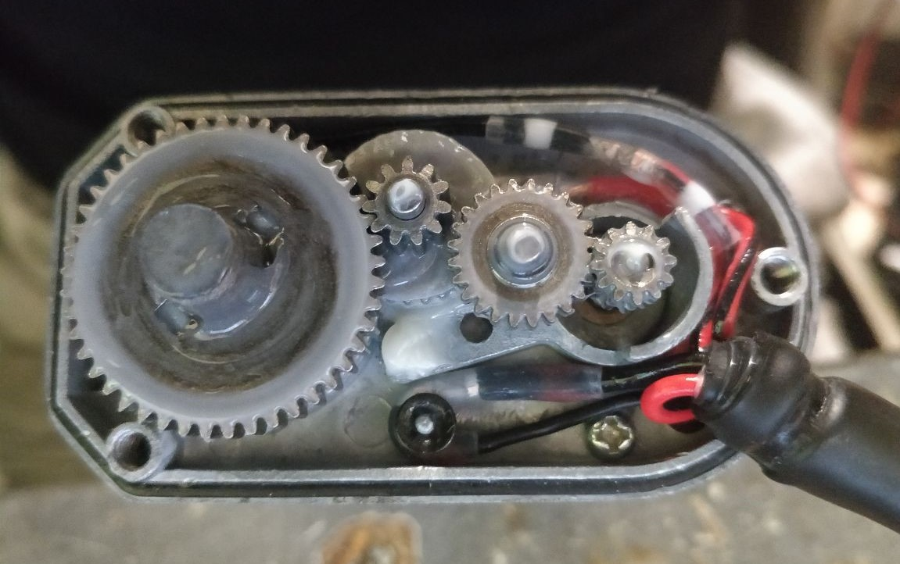
As I didn't have a 3 wire cable big and flexible enough, I used two speaker wires and added multiple layers of heat shrink. While the heath shrink was still hot, I pressed on the cover to create something that look good enough and has some strain relief. It's not the prettiest thing, but it works and will barely ever be seen.

## Schematic
As this project is very similar to my previously done garage door controller, I based a lot of the design from it.

### Powering the board
I went with a basic circuit with a DC-DC convert to reduce 12v to 5v. Also added some decoupling caps, a power LED and a jumper for disconnecting the 12v input
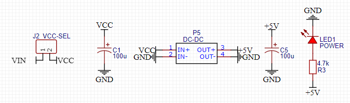

### Rotation direction of the motor

Next is the detection of the motor direction, same design as my garage door controller, one optocoupler works when opening and the other one when closing. 
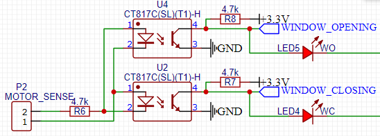

### Powering the motor
I could have used a traditional H-Bridge (like a L293) but as I don't need speed control, so I simply used two SPDT relays that I had on hand. Depending which one I turn on, the motor will spin in the according direction.
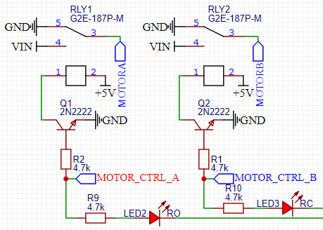

### User buttons
To still be able to use this thing without a phone, I added 3 buttons to control the motor (open, close, and stop). I also tied the stop button to GPIO0, which is the boot pin for the esp8266.
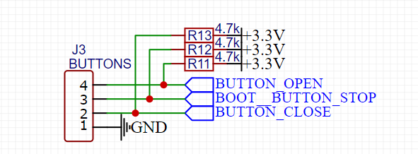

### MCU
For the mcu, I choose a simple esp8266 with both a d1 mini footprint and an esp12 footprint (with an ams1117 to get 3.3v):
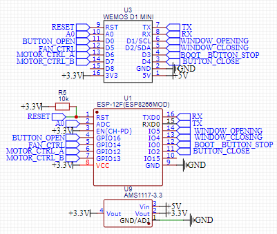

## Prototype
Subsequently, I did a very crude prototype:
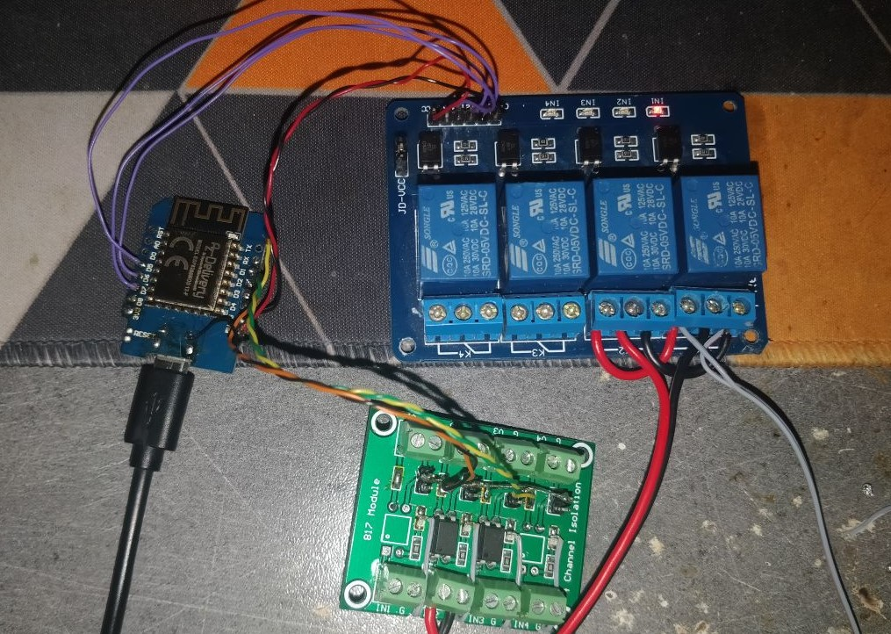

## PCB
And everything worked, so I designed a pcb:
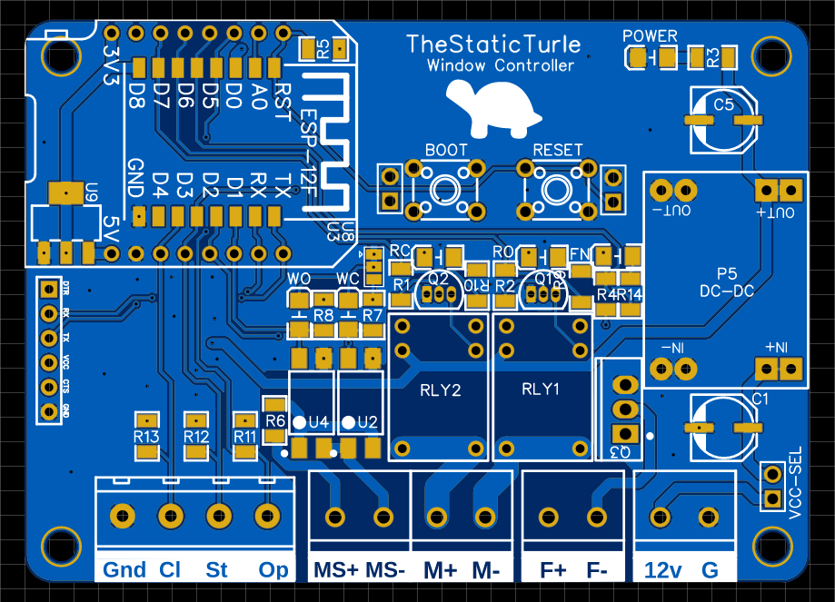
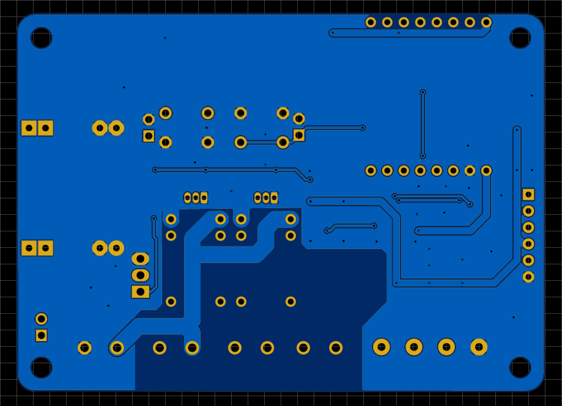
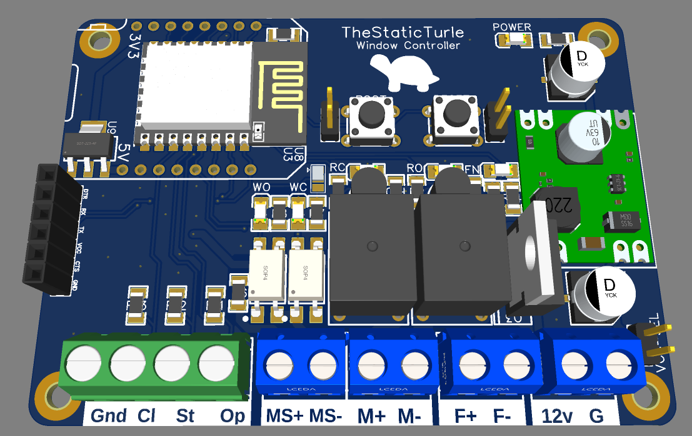

Once again, PCBWay stepped in and offered to manufacture the PCB


## Soldering the board

After waiting for one week, I received the PCBs

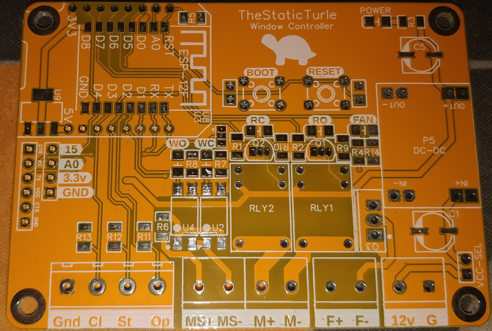
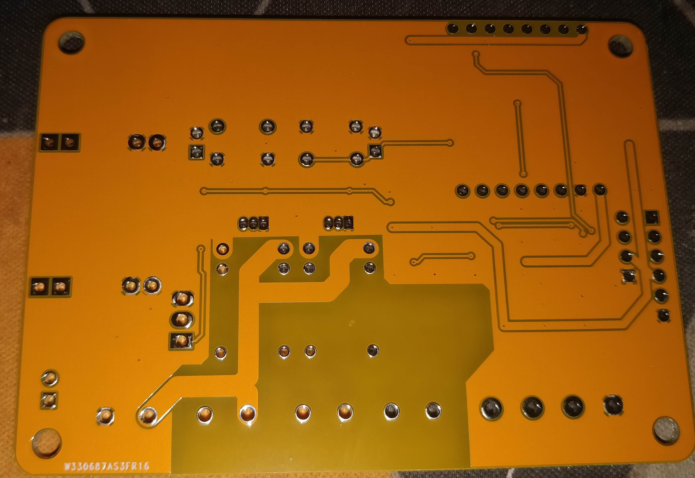

After looking at the PCBs, they were pretty good, nothing wrong with the 5 boards.

A quick test later, I concluded that the board worked just fine.

## Software

As this isn't a massive project, I did all the software development under the Arduino IDE.

In short, the esp8266 connects to my home Wi-Fi network and then connect to the MQTT server running on my home automation VM. It then listens for command and periodically reports the window status, over the serial port, mqtt.

Almost all the functions use two structs, one for reading the state of the window and another one for sending commands:

```c++
enum window_status_t {
  DS_OPEN           = 0,
  DS_OPEN_PARTIAL   = 1,
  DS_OPENING        = 2,
  DS_CLOSING        = 3,
  DS_CLOSED         = 4,
  DS_ERROR_UNKNOWN       = 251,
  DS_ERROR_OVERCURRENT   = 252,
  DS_ERROR_HANDLE_CLOSED = 254,
  DS_UNKNOWN = 255,
};

enum move_direction_t {
  MV_STOP   = 0,
  MV_OPEN   = 1,
  MV_CLOSE  = 2,
};
```
As you can see in the `window_status_t` struct, I added some edge cases that I actually didn't implement in hardware (such as the handle sensor or the overcurrent sensor). I might add the handle sensor in the future because that motor will rip that thing out without any question if it starts opening with it closed.

The main function responsible to move the window is this one:

```c++
bool move_window(move_direction_t direction) {
  switch(direction) {
    case MV_STOP:
      digitalWrite(pin_motor_open, RELAY_DISABLE_VALUE);
      digitalWrite(pin_motor_close, RELAY_DISABLE_VALUE);
      break;
    case MV_OPEN:
      digitalWrite(pin_motor_open, RELAY_ENABLE_VALUE);
      digitalWrite(pin_motor_close, RELAY_DISABLE_VALUE);
      break;
    case MV_CLOSE:
      digitalWrite(pin_motor_open, RELAY_DISABLE_VALUE);
      digitalWrite(pin_motor_close, RELAY_ENABLE_VALUE);
      break;
  }
  
  delay(150);
  
  window_status_t status = getWindowStatus();
  
  if(direction == MV_STOP  && (status == DS_OPEN_PARTIAL || status == DS_OPEN || status == DS_CLOSED)) { return true; }
  if(direction == MV_OPEN  && (status == DS_OPEN    || status == DS_OPENING)) { return true; }
  if(direction == MV_CLOSE && (status == DS_CLOSED  || status == DS_CLOSING)) { return true; }

  Serial.println("Error:");
  send_status_update_all(getWindowStatus());
  
  return false;
}
```
It works like this: 
 - First, we set the motor direction.
 - Then, it waits a moment.
 - Check that's either going to correct direction or that it's in the state we want it to be in
 - Exits

## Home assistant integration
You can see here are the message the board transmits via mqtt:
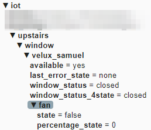

I then hit the same issue that I had with my garage door controller. HomeAssistant doesn't support a mqtt cover with a status "partially_opened". So, I need to transmit two window_status messages the first one is "normal" and the second topic treats the `partially_opened` state as `open`

You can also see a fan sub-topic, on the pcb, I added a fan output in case I want to add a fan in the future.

Here is the HomeAssistant configuration:
```yaml
- platform: mqtt
  device_class: shade
  unique_id: "velux_chambre_samuel"
  name: "Velux samuel"
  availability_topic: "iot/upstairs/window/velux_samuel/available"
  payload_available: "yes"
  payload_not_available: "no"
  command_topic: "iot/upstairs/window/velux_samuel/command"
  payload_open: "open"
  payload_close: "close"
  payload_stop: "stop"
  state_topic: "iot/upstairs/window/velux_samuel/window_status"
  state_closed: "closed"
  state_open: "open"
  state_closing: "closing"
  state_opening: "opening"
  state_stopped: "open_partial"
```
The result is a nice entity showing up on the dashboard:


Now let's do some automation, I couldn't do an automation easily with the UI, so I went full YAML mode and wrote this:
```yaml
alias: Velux
description: ""
trigger:
  - platform: time
    at: input_datetime.time_open_velux_samuel
    id: "open"
  - platform: time
    at: input_datetime.time_close_velux_samuel
    id: "close"
condition: []
action:
  - service: "cover.{{  trigger.id  }}_cover"
    entity_id: cover.velux_samuel
```
Basically, it has two triggers with a corresponding ID, I can then use this ID as a template in the action part of the automation.

After adding the open/close time helpers and adding everything to the UI, I have a very nice interface to control the thing

I could have used the sun rise time as a way to schedule the closing time of the window, but I prefer being able to manually set it.

## Case & finished installation

### User inputs
I spent a bit of time on SolidWorks designing a button box that's not completely stupid to stick on my wall:
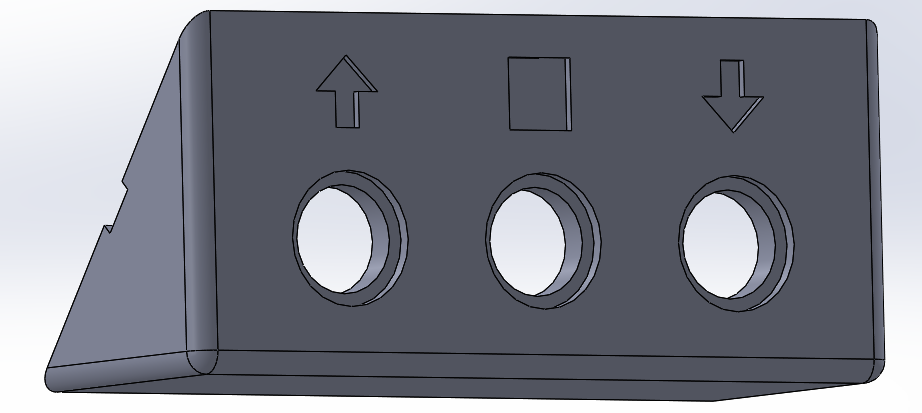
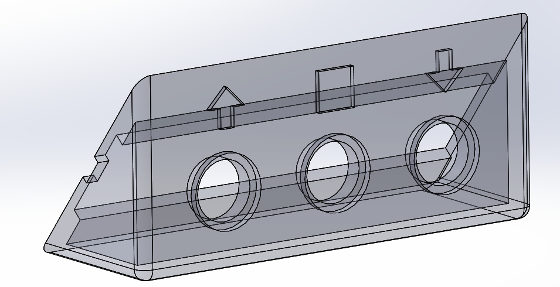
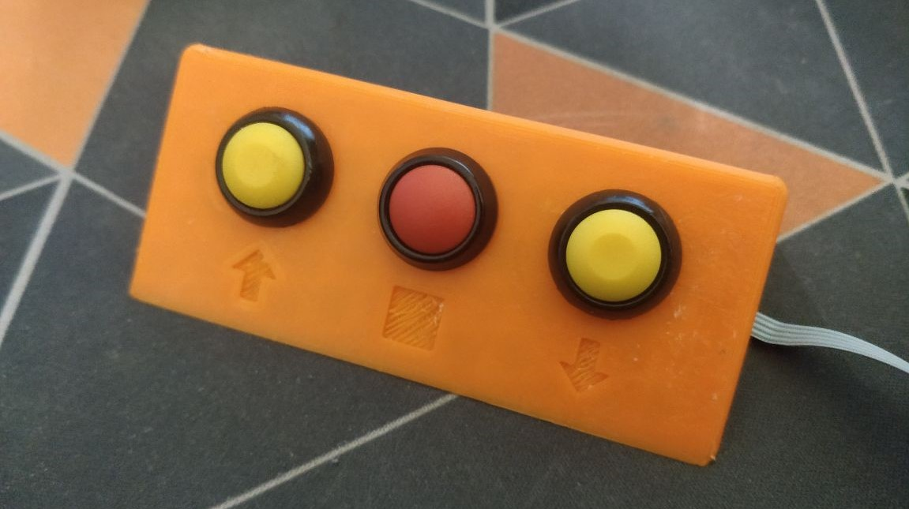

This was originally intended to match the angle of the roof and put the button parallel to the wall, but instead it fitted just perfectly to the top of my mosquito net, so I put it there instead.

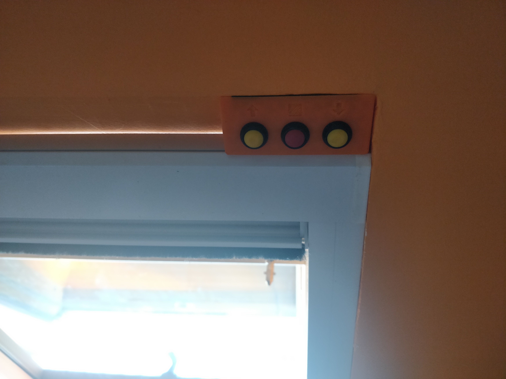

### Controller
I then spent more time designing a case for the controller:
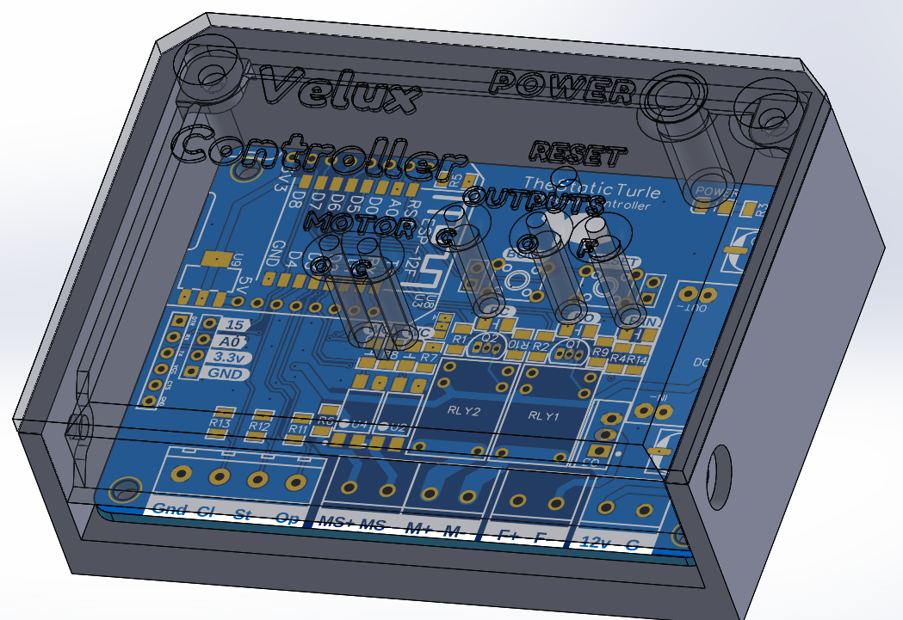
As you can see, I also added light pipes to the cover. These light pipes will be filled with hot glue and painted black (when I'll get the time to do it).

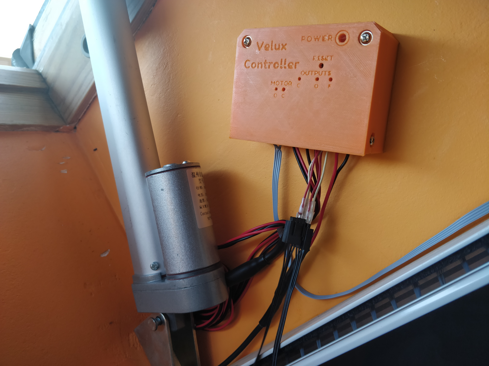

## Demo

And here is a little demo video of the whole system:


## Noteworthy stuff
Here are some things that I learned the hard way on this project:
 - Not touching that grease again
 - esp8266 modules really don't like 20v DC
 - Use proper drywall screws or wall anchors to secure things
 - When you sleep opening / closing speed isn't critical, so it's better to have a slower & quieter motor than a high-speed & noisy motor

## Links

Arduino's code / 3D files / schematic / PCB:  [https://github.com/TheStaticTurtle/TiltWindowController](https://github.com/TheStaticTurtle/TiltWindowController)

Again, thanks to  [pcbway](https://www.pcbway.com/) for letting me try out their PCB manufacturing for this project, and if you would like to chat about it or other projects, please join my discord here:

https://discord.com/invite/z8bwtdE

