Writing a NodeRed flow to determine when my pool will be at an acceptable temperature using the sun and maths

<!--more-->

I'm one of the lucky ones to have a pool at my home. But I never know when it's actually hot enough for me to go in, and having the ability to know in advance would be wonderful, since I could plan my day more easily.

We put our pool on the south-east corner of our property (which means it get sunlight for the whole day) and has a "bubble cover" that help them heat up in the sun.

## Data
I already have temperature sensors in my pool, yes sensor**s** one at the top and one at the bottom
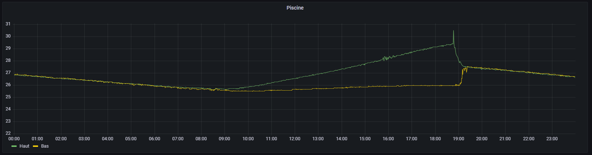

You can see at 18h45 the pump turning on and mixing the water (which takes about `30min`).

You can also see that the temps start rising around `9h30` in a pretty linear way. A bit of digging later, and this time correlates with the sun elevation going over `35deg`, which is the angle at which it starts covering almost all the pool.
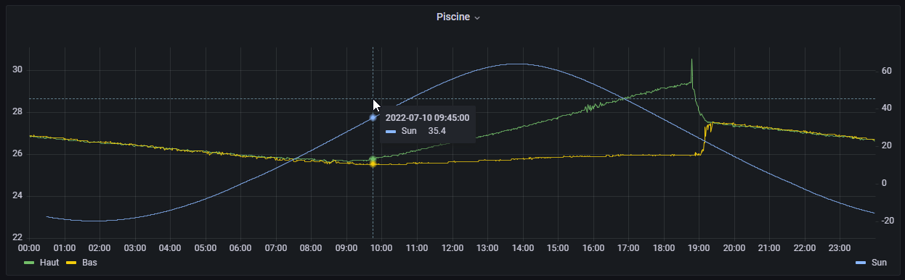

After verifying this theory by checking day by day that it actually matches (at least somewhat, I don't want something precise to the second, just to the half hour), I started to work on predicting the temp.

# Prediction theory

Since the temperature rise is pretty linear, I went with a very basic linear interpolation between two points.

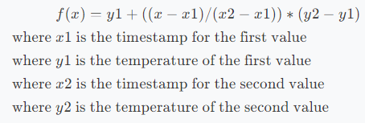

This also means that as I'm not using a fancy Ai to determine the temp, I can't do it before I have an acceptable value for the first and second point which I randomly set at 10h30

On the `11 of July 2022` where I live, the sun attained `35deg` at approximatively `9h28` (± 5 min)
At `9h28`, the top pool sensor reported a temperature of approximatively  `25.72degC`.
At `10h30`, the sensor reported a temperature of approximatively `26.06degC`.

The timestamp for `9h29` being `1657438080s` and the timestamp for `10h30` being `1657441800s` 

Let's say I want the temperature at 16h30 (`1657452600`) we can use the previous defined formula like this:
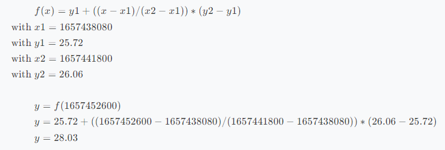

Let's check the results, according to the sensor, at `16h30` the temp was `28.49degC`, neither a bad result nor a perfect one. A `.5degC` deviation is a high, but this was approximatively one hour after it started to heat up, it can't be that precise.

Doing the calculation again using the temperature at `14h00` for `x2` & `y2` results in a prediction of `28.3degC` which I find acceptable for such a crude solution

## Some code
As I wanted to keep things simple (says the man writing code to predict the pool temperature), I used node red, which is a remarkable tool for quickly manipulating data or a stream of data.

In the middle of building the flow, I thought that it might be a good idea to have a floating `x2` & `y2`. I decided to use the last value gathered by the sensor (with a limit of `17h00` to avoid issues with the pump). So, I went ahead and rewrote most of it.

### Constants
First part is an `inject` node that start at `10h00` and triggers every `10min` until `17h00`, that then feed through a `function` node that sets some constants:
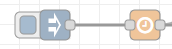
```js
msg.desired_temp = 28.25
var d = new Date();
msg.query_start_time = d.toISOString().substr(0,11) + "00:00:00.000Z"
msg.query_stop_time = d.toISOString().substr(0,11) + "23:59:59.999Z"
return msg;
```
### Data query
I then use the `template` node to build the query and the `influxdb in` node to retrieve the data
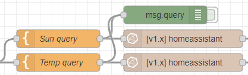
```sql
SELECT
    mean("elevation") AS "mean_elevation"
FROM
    "homeassistant"."autogen"."sun.sun"
WHERE
    time > '{{query_start_time}}' AND
    time < '{{query_stop_time}}'
GROUP BY
    time(30s)
FILL(linear)
```
The query for the temperature is almost the same except for the `GROUP BY` using `time(60s)`, you'll see later why this is "needed".
This query gives a result similar to this (`null` meaning the sensor didn't have a value at the time):
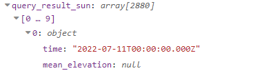

I then immediately enter a `function` node to get the time when the sun reached 35deg
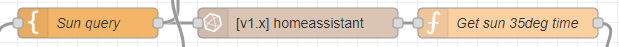
The code loops through all the points and if the elevation is greater than `35deg` store it in the message object and return it.
```js
for(let point of msg.payload) {
    if (point.mean_elevation > 35) {
        msg.sun_35deg_localtime = (new Date(Date.parse(point.time))).toLocaleTimeString()
        msg.sun_35deg_iso       = point.time
        msg.sun_35deg_exact     = point.mean_elevation
        return msg
    }
}
```

I then need to join the two separates messages from the two queries into one. The simplest way to do it I found is to use a `join` node configured to expect two messages and return one array as the payload, followed by a `function` node to re-organize it
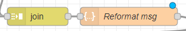

And this is why I used two different time groups in the query on array will be bigger than the other. It's very hacky, but works, I'm welcome to a suggestion (using a topic as the key pop's in my mind)
```js
if(msg.payload[0].length > msg.payload[1].length) {
    msg.query_result_sun = msg.payload[0]
    msg.query_result_temp = msg.payload[1]
} else {
    msg.query_result_sun = msg.payload[1]
    msg.query_result_temp = msg.payload[0]
}
delete msg.query
return msg;
```

### Data manipulation
Originally, I planned to smooth out the temperature to get a more accurate reading, that proved wildly ineffective and decreased the accuracy by approximatively `3degC`, here is the code for the node anyway (it's a basic low-pass/smoothing function):
```js
// Deepclone
msg.query_result_temp_smooth = JSON.parse(JSON.stringify(msg.query_result_temp))

let smoothing = 40;

var value = msg.query_result_temp_smooth[0].temp_top; // start with the first input
for (var i=1, len=msg.query_result_temp_smooth.length; i<len; ++i){
    var currentValue = msg.query_result_temp_smooth[i].temp_top;
    if(currentValue) {
        value += (currentValue - value) / smoothing;
        msg.query_result_temp_smooth[i].temp_top = value;
    }
 }
return msg;
```

#### Extracting temps
Next, the data goes to another `function` node to extract the temp when the sun is at `35deg` and the temp either now or at `17h00`:
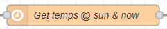
It's very similar to the first function, it loops through all points and when it meets the condition, stores it in the message object and break out of the loop.
To get the last point between `17h00` and `09h00`, I reverse the data and added a simple condition to check the hours (this means that, right now, it will get the value around `17h59`, not an issue though).
```js
let timeSun = Date.parse(msg.sun_35deg_iso)

for(let point of msg.query_result_temp) {
    let time = Date.parse(point.time)
    if (time > timeSun) {
        msg.temp_at_sun = point.temp_top
        msg.temp_at_sun_time = point.time
        msg.temp_at_sun_time_local = new Date(time).toLocaleTimeString()
        break
    }
}

for(let point of msg.query_result_temp.reverse()) {
    let timestamp = Date.parse(point.time)
    let time = new Date(Date.parse(point.time))
    if (time.getHours() <= 17 && time.getHours() > 9 && !!point.temp_top) {
        msg.temp_at_now_or_1700 = point.temp_top
        msg.temp_at_now_or_1700_time = point.time
        msg.temp_at_now_or_1700_time_local = time.toLocaleTimeString()
        break
    }
}
return msg
```
#### Linear interpolation
Now that we have our constants for the linear interpolation, we can use another `function` node, to create the values:
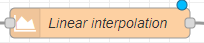
First, we declare some constants like the `start`, `stop` and `step` time for the interpolation. Next, we use the function defined in the last part and create the dataset, assign it to the message object (along with the constants) and return it.
```js
let interpolation_start = Date.parse(msg.query_start_time)
let interpolation_stop = Date.parse(msg.query_stop_time)
let interpolation_step = 1 * 60 * 1000

let x1 = Date.parse(msg.temp_at_sun_time)
let y1 = msg.temp_at_sun
let x2 = Date.parse(msg.temp_at_now_or_1700_time)
let y2 = msg.temp_at_now_or_1700

let array = []
for(let x=interpolation_start; x<interpolation_stop; x+=interpolation_step) {
    array.push({
        time: new Date(x).toISOString(),
        interpolation: y1 + ((x - x1) / (x2 - x1)) * (y2 - y1)
    })
}

msg.interpolation_params = { x1, y1, x2, y2 }
msg.interpolated_temp = array

return msg
```

The next step is to get when the **top of the pool** will be at `28.25degC`. To accomplish that, I use yet another `function` node and use the same code as I used to get the temps at a specific time, the only difference being that I search for the time instead of temperature. I also added a little margin to make sure I catch a value.
**NB: I cloud have done the proper thing here and calculate an equation that take a temperature and return a timestamp, but it's 3am :bed: and don't really need it in this instance.**
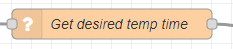
```js
for(let point of msg.interpolated_temp) {
    let time = Date.parse(point.time)
    if (point.interpolation > msg.desired_temp-0.12 && point.interpolation < msg.desired_temp+0.12) {
        msg.desired_temp_time       = time
        msg.desired_temp_time_local = new Date(time).toLocaleTimeString()
        msg.desired_temp_time_iso   = new Date(time).toISOString()
        msg.desired_temp_actual     = point.interpolation
    }
}
return msg
```

### Visualization
The last step is visualization, the first thing that happens is that the message goes into a `function` node that will round all the values to an acceptable decimal point (2 for the values and 6 for the interpolation parameters)
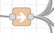

Then, it goes into multiple `function` & `template` nodes that then goes into multiple `UI` nodes, a `debug` node and an `homeassistant sensor` node:
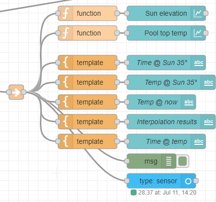

And that gives me a nice NodeRed dashboard:
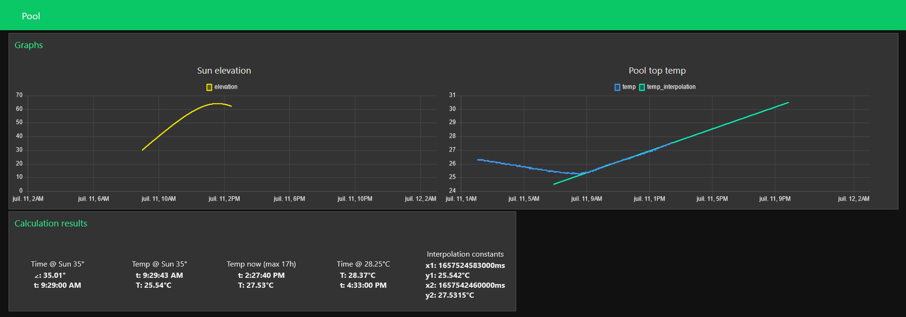

And you can see that (at least when I wrote this article) the prediction pretty much spot on. The ha sensor does his job and can be visualized in the dashboard:
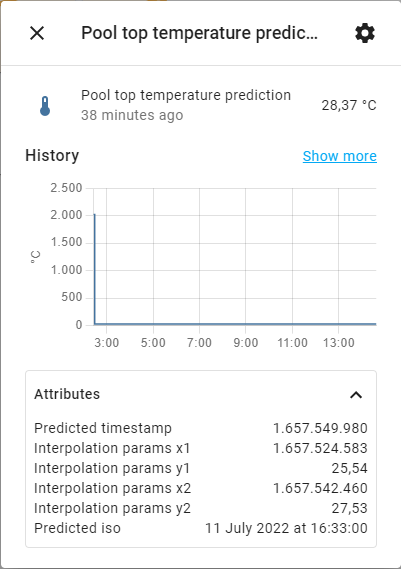
Don't mind the graph the values are a bit messed up because I put the wrong value in the state during testing and didn't bother clearing the database.


## Notes

This was done as an experiment and for fun when I noticed that the temperature curve was somewhat linear, not as an actual statistical analysis that I would actually rely on.
I'm not a maths head either, there are probably better ways to do this.

To get the actual temperature of the pool, I would need to do some more maths to average the top and bottom sensor, I, however, do no care :sweat_smile:.

Things I learned:
 - InfluxQL queries (very briefly), it feels quite a bit like SQL, so it was pretty easy to write a query that worked
 - Did some "maths" again :sweat_smile:
 - Learn how to use the NodeRed dashboards for the first time. Conclusion is not fan, but works very well for quickly displaying data
 - Read quite a bit about data prediction while searching things for this project.
 - NodeRed still rocks :rocket:

If you want the flow, email me (see my portfolio), I'll send it to you. If you would like to chat about it or other projects, please join my discord (https://discord.com/invite/z8bwtdE) or directly comment below :smile: