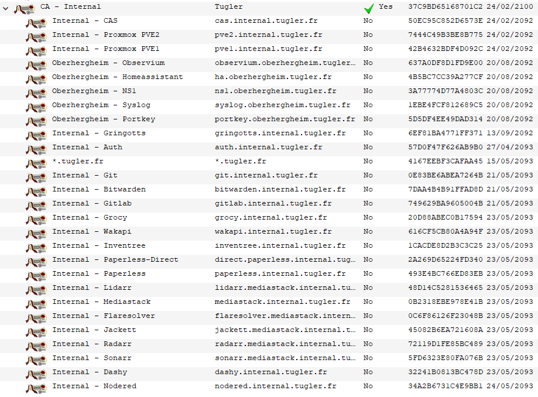
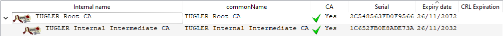
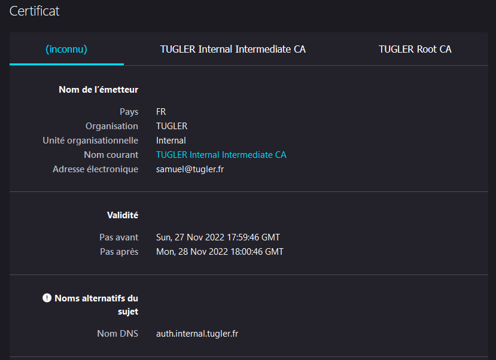
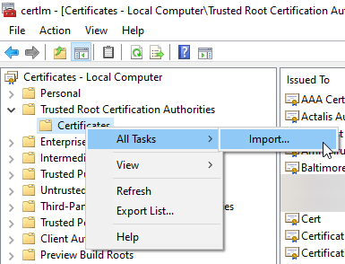
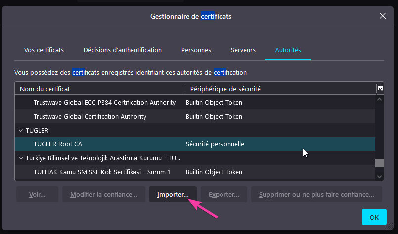
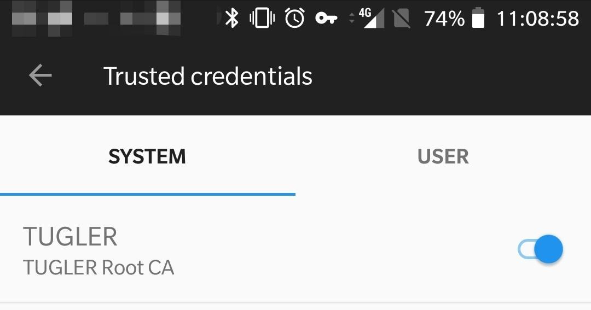
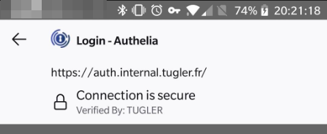
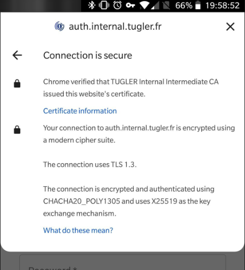

Running the open-source step-ca ACME server to provision SSL certificates in my homelab

<!--more-->

Firstly, what is an ACME:
ACME means **Automatic Certificate Management Environment** it's a protocol for automating interactions between certificate authorities and servers, allowing the automated deployment of public key infrastructure.

Basically, it's a server that has access to a certificate authority that goes: here is a ssl certificate for domain xxxxxxx.tld to any server that can prove that it owns xxxxxxx.tld 

## Why SSL in the first place

SSL is a way to add security to a service, having a server in a homelab environment shouldn't equal to http is fine. Because it's a useful way to detect unwanted changes (MiTM attacks from hacker friends, for example) and simply a better practice.
Not to mention some apps already uses SSL with no way to disable it (like proxmox) so why not do it properly.

Furthermore, it's f-ing cool 😎

## The "why don't you section"
### Why an ACME, why not manually?

Well, running a CA manually is more than fine. 
Except that when you reach the point where you have +20 ct/vms, you spend all your time provisioning and renewing certificates

Here is a screenshot of my XCA database, pretty full, heh


I do think that XCA is the way for small setups, as it's pretty easy to use.

But for me even certs that have a 70-year validity (which is actually an issue, see next paragraph) it's a pain to manage.

### Why don't you use a long validity period

Well, for this the answer is pretty simple, [Mozilla decided to reduce the validity period for TLS certs to 398](https://blog.mozilla.org/security/2020/07/09/reducing-tls-certificate-lifespans-to-398-days/) which isn't big compared to 70 years, but it's just enought for you to forget about it and go "Oh. Fuck." when every cert breaks at the same time.

### Why don't you use ADCS
Well, windows just plain sucks, I'm sure it's great when you learn all the hacks to make it work, but I want something stable where I won't spend 80h just to get a certificate. Hell, I still need to figure out why my AD just shutdowns randomly from time to time.

## First steps

There isn't a ton of open-source tools that provides an ACME server, so I had the idea to build one! 
I actually read a significant amount of the [RFC](https://www.rfc-editor.org/rfc/rfc8555.html) and implemented quite a bit when I discovered step-ca.

> `step-ca` is an online Certificate Authority (CA) for secure, automated X.509 and SSH certificate management. It's the server counterpart to [`step`  CLI](https://smallstep.com/docs/step-cli). It is secured with TLS, and it offers several configurable certificate provisioners, flexible certificate templating, and pluggable database backends to suit a wide variety of contexts and workflows. It employs sane default algorithms and attributes, so you don't have to be a security engineer to use it securely.

Great that look perfect and as a bonus, they have a superb tutorial for a [small homelab CA](https://smallstep.com/blog/build-a-tiny-ca-with-raspberry-pi-yubikey/)

## ACME Setup

As I don't own a Yubikey, I didn't exactly follow the tutorial. 
Instead, because step-ca doesn't have an easy way to customize the root and intermediate CA,  I started by creating them in XCA, 


The root and intermediate CA infrastructure is perfect because I actually intend to manage two sites (my lab and the small setup at my parents) and I can use different intermediate CA for both while still having one root.

Next, I run the init process for step-ca with dummy data to create the file structure/default configs

I then opened and replaced the content of:
- Root CA certificate `/root/.step/certs/root_ca.crt`
- Intermediate CA certificated `/root/.step/certs/intermediate_ca.crt`
- Root CA key `/root/.step/secrets/intermediate_ca_key`
- Intermediate CA key `/root/.step/secrets/root_ca_key`

By what I exported from XCA.

I then proceeded by running `step ca provisioner add acme --type ACME` which added an ACME certificate provisioner with the name `acme`

Next I edited the config at `/root/.step/config/ca.json` and added the right domains in the `dnsNames` array,  and also edited the `commonName` key to something I liked.

The next step was to create a systemd service to start the acme: 
```systemd
[Unit]
Description=step-ca
After=syslog.target network.target

[Service]
User=root
Group=root
ExecStart=step-ca
Type=simple
Restart=on-failure
RestartSec=10

[Install]
WantedBy=multi-user.target
```

After running:
```shell
root@cert.internal:~# systemctl enable step-ca.service ce
root@cert.internal:~# systemctl start step-ca.service
```

I had my server up and running.

## ACME Client setup

So, now that we have an ACME server, we need to actually use it.

First server I updated is my auth server. It uses Caddy as a reverse proxy according to the step-ca docs you need to pass the root ca as an environment variable. However, I would rather not deal with it with docker, so my config looks like this:
```caddy
auth.internal.tugler.fr {
        tls {
                ca https://cert.internal.tugler.fr/acme/acme/directory
                ca_root /etc/caddy/root_ca.pem
        }
        reverse_proxy authelia:9091
}
```

```docker
  server:
    image: caddy
    ports:
      - '80:80'
      - '443:443'
    volumes:
      - './Caddyfile:/etc/caddy/Caddyfile'
      - './root_ca.pem:/etc/caddy/root_ca.pem'
    restart: unless-stopped
```

I proceeded by restarting the stack, and it worked the first time:


Nice 😃

The process for certbot is simple, I just need to add the `--directory https://cert.internal.tugler.fr/acme/acme/directory` argument to the command to tell it which server to use

After looking at the cert a bit closely, I need to modify the certificate templates for the provider to add the CN and other things since they are empty for now, but it already works with very minimal effort.

## Adding the root CA to clients
Now that we have everything running, we have to tell our clients to actually trust the CA. Pretty easy, you would think? Well, not so, depending on the platform!
### Windows
Windows is easy, just import the certificate to the Machine "Certification Authority" store

#### Chrome
Chrome takes the certificate from the Windows store, so that's done!
#### Firefox
Firefox, as always, is again doing things differently, so you have to go into the options and import it there as well.

I think that one shitty decision Mozilla made, is the fact that a certificate for "pve1.internal.tugler.fr" will work if you use this url "https://pve1.internal.tugler.fr", but not for "https://pve1.internal.tugler.fr:8006" it's logic but a pain in the ass. As proxmox for example doesn't allow ports or IPs in a domain for ACME.

### Servers
I use some Ansible script to manage my servers, so it was as simple as creating a new role for the server that needs the root ca, coping the file adding the role to my "common" playbook:
```yaml
---
- name: Make sure the folder exists
  file:
    path: /usr/local/share/ca-certificates
    state: directory

- name: Copy the certificate
  copy:
    src: "files/tugler_ca_root.pem"
    dest: "/usr/local/share/ca-certificates/tugler_ca_root.pem.crt"
  register: result

- name: Update CA Trust
  command: update-ca-certificates
  when: result is changed
```

### Android
Android …., what a nightmare, it's so annoying it's actually incredible 😤.
First thing you need to know is that it's not called certificates it's called credentials, good luck finding it in the settings.
Moreover, there are two certificates store, the user store and the system store.
The system store contains the root CA and the user store generally contain user credentials for thing like VPNs.

Importing the certificate to the user store is actually straightforward, download the cert, enter your pin, give it a name, and it's done.

#### Apps
However, I want to use apps like paperless ingest, HomeAssistant, Bitwarden, grocy, ..... 
And guess what, apps want the certificate in the system store.

I'm sure you could do this properly in a managed setup. However, I don't have time to manage that, and my phone is already rooted, so how can we do it?

Turns out, you can either do it manually each time you reboot by moving files around, or you can  use a magisk module that does just that:


I proceeded by reading the script (always do this before randomly giving root access to something you don't trust), installed it, rebooted and boom here it is:


And you know what? It actually worked:


#### Firefox
You would think it would be easy, right? That Firefox would just work? 🤡

Guess what, Firefox doesn't use system or user provided certificate by default. You have to go into the "Secret Settings" to enable it. 

So to make Firefox trust my CA, I have to:
 - Go to Settings > About
 - Tap the Firefox icon 3 times
 - Got to Settings > Secret settings
 - Enable "Use third-party CA certificates"🙄

But it works:


#### Chrome
Chrome is a system app, right? So, it should just work, right? 🤡
Well, it did until a few years ago, when they started to require certificate transparency.

What the hell is certificate transparency in the first place?
From what I understand, it means that there are public servers that log the certificates changes of public websites when they are issued from well-known CAs. And that chrome queries at least two of these server them to check that it's still valid. Seems pretty useful. 

AdGuard has a page explaining it a bit: https://kb.adguard.com/en/general/https-filtering/https-filtering-known-issues

Unfortunately, nor my CA, nor my website is public, so what do I do? 

It turns out that because it's in the system store, chrome thinks it's a well trusted CA 😶 and wants to verify it, bummer! It can use the one in the user store, but will prioritize the system store.

So, what do you do? 
Apparently, there is a way to do it properly use a managed setup (again) and manually telling chrome that this cert doesn't need to be verified
Or, you hide the one in the system store from chrome.

Chrome doesn't need root anyway, so I choose to hide it, in magisk I had to:
- Enable `Zygisk`
- Enable `Enforce DenyList`
- Go into the Deny List
	- Enable system apps
	- Check the chrome app

After doing all this and force closing chrome, ignoring the pop-up about installing a CA on first load 🤨, my CA was now valid:


This shouldn't be a problem for non-rooted phones anyway because you wouldn't be able to add it to the system store in the first place.

## Conclusion

Well, it was quite an adventure, but now I hopefully don't have to worry about certificates, until the intermediate one expires in 2032 at which point I can just renew and certs will be re-issued automatically. Great 😄

There are two things I'm not happy about, tho:
- The private key of the CAs live in the file system, it works for a homelab but isn't the best. Ideally when I'll prioritize my budget towards the homelab I'll buy YubiKeys and store the cert on it as it seems pretty easy to do.
- The certificate issued by the ACME provider are missing a few fields which isn't a big deal, but it looks pretty easy to add them, so I'll do this in the coming weeks 
