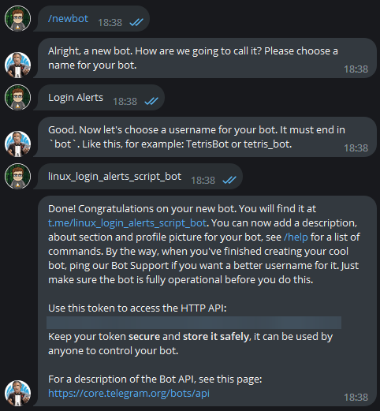
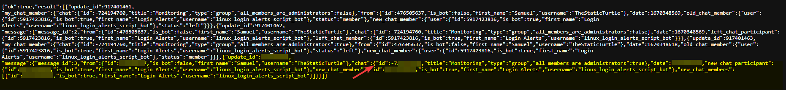

Writing a small bash script to send a notification in my telegram monitoring channel each time a user logs in to one of my server

<!--more-->

I thought it was a nice little idea to set up a script that notifies my when a user logins into one of my most important VMs/CTs/Hosts. Of course there are probably ways around it, but it was somewhat fun to write. So let's dive in!

## Notifications
For the notifications, I choose Telegram, mostly because I already have most of my notifications in there already and because the API is just so simple 😲

### Creating the bot
Telegram makes it ridiculously easy to create a new bot, so I just dm-ed @BotFather and got a new token.


Subsequently, all, I had to do is add the bot to the group I use for monitoring. Then I could use the API myself to determine the chat ID of my group:

I simply went to `https://api.telegram.org/botTELEGRAMBOTTOKEN/getUpdates` in my browser (with `TELEGRAMBOTTOKEN` being the real token) and got the chat id:



On Telegram, chat ID are negative, and user IDs are positive, so it was pretty easy to find.

I then ran:
```bash
curl -X POST \
     -H 'Content-Type: application/json' \
     -d '{"chat_id": "'"$TELEGRAM_CHAT_ID"'", "text": "This is a test from curl", "disable_notification": true}' \
     https://api.telegram.org/bot$TELEGRAM_BOT_TOKEN/sendMessage
```
 With the correct variables, and it worked, nice 😀


## Writing the script

After having a way to send messages, I need to generate what I need to send.
 - Getting the hostname is easy: `hostname -f`
 - Getting the current user is also pretty easy: `$USER`
 - Getting the current session took a bit of digging, but it's also pretty easy: `who -m`

So, I wrote a little script to combine everything and send the message:
```bash
TELEGRAM_CHAT_ID="-----censored-----"
TELEGRAM_BOT_TOKEN="-----censored-----"

HOSTNAME=$(hostname -f)
WHO_OUT=$(who -m)

MESSAGE="User "$USER"@"$HOSTNAME" logged in from: \n"$WHO_OUT

DATA='{"chat_id": "'"$TELEGRAM_CHAT_ID"'", "text": "'"$MESSAGE"'", "disable_notification": true}'

curl -X POST -H 'Content-Type: application/json' -d "$DATA" "https://api.telegram.org/bot$TELEGRAM_BOT_TOKEN/sendMessage" 2>/dev/null 1>/dev/null
```

Did a quick test, it worked, nice

## Deploying the script

I'm starting to use Ansible to deploy configs to my servers, so I just created a new role with this task: 
```yaml
- name: Copy profile script
  when: ansible_os_family == 'Debian'
  copy:
    src: files/Z99-notify-login.sh
    dest: /etc/profile.d/Z99-notify-login.sh
    owner: root
    group: root
    mode: 0755
  register: copy_login_notify_script
```
 
 And added said role the playbook.yaml (parts are redacted, hence why it's in different blocks)
```yaml
- hosts: core
  roles:
    - security_login_notify

- hosts: proxmox_pve
  roles:
    - security_login_notify

- hosts: proxmox_pbs
  roles:
    - security_login_notify
```

## Demo
https://youtu.be/Lo27E83Gc0I

## Conclusion
This is a very little script that, honestly, is just a gimmick, there definitively are ways to bypass it (for example Ansible doesn't trigger it because it doesn't load the profile).

I wrote it mainly to track logins of one machine which is exposed to the outside for me to use as a bastion.