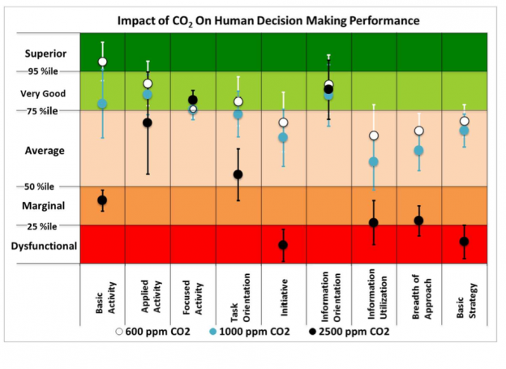
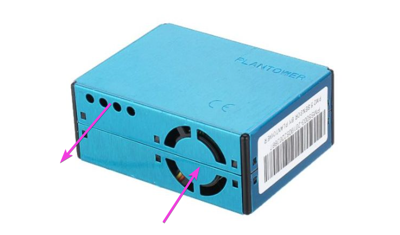
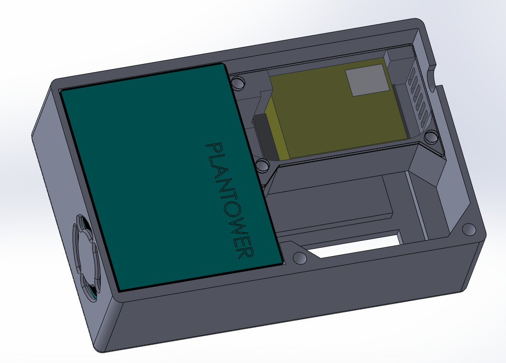
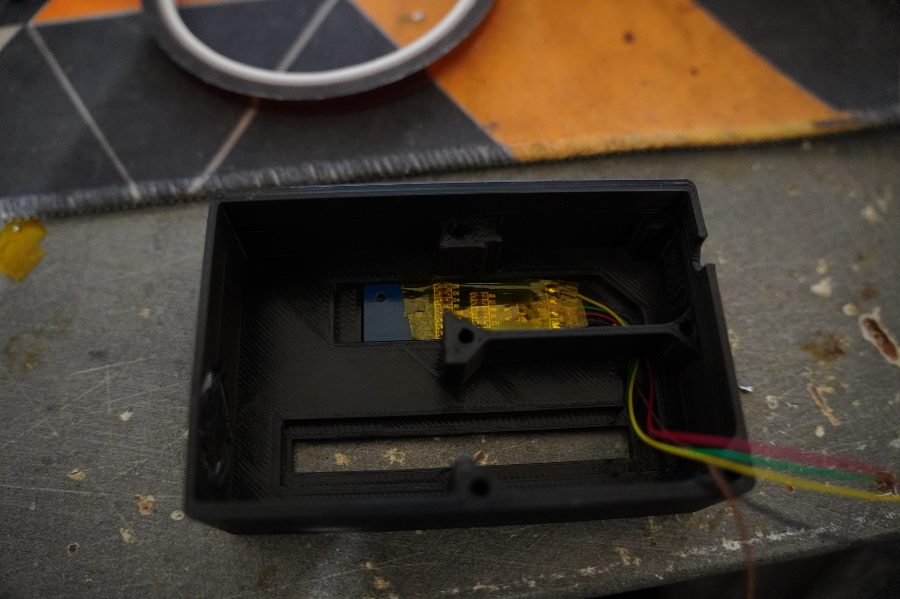
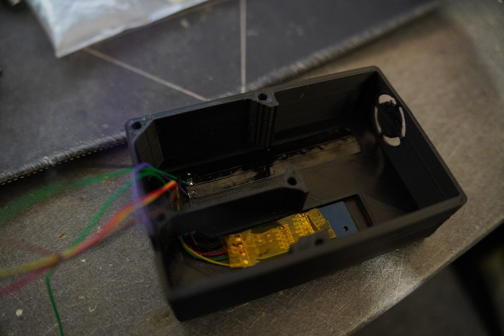
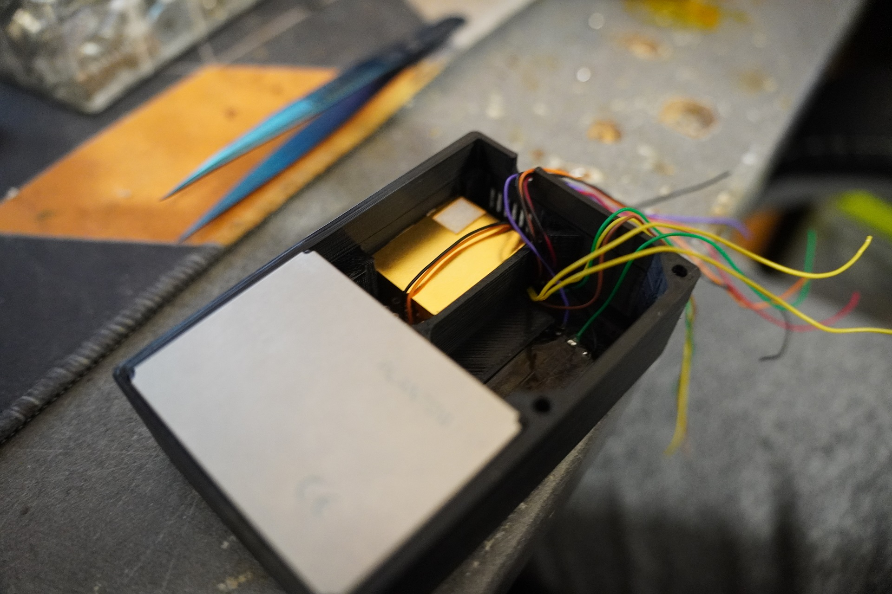
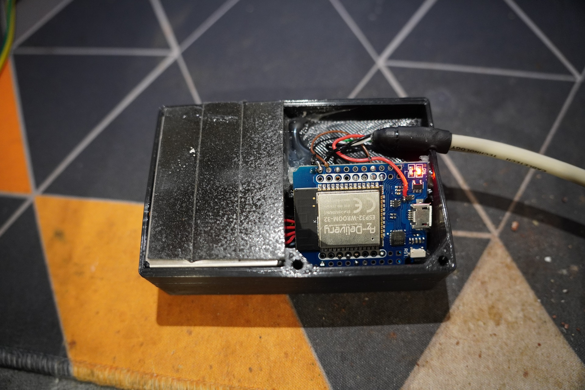
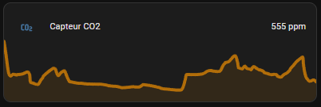
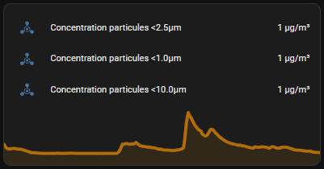

Building a DIY CO2 and PM2.5 sensor to measure the air quality in my office and improve my home-maker life.

<!--more-->

As I spend most of my day in my office 🤓, I thought it would be a good idea to measure the CO2 levels of the room. CO2 isn't as dangerous as CO, but it can still pose some issues if the levels are too high.
And after being in a room that hasn't any ventilation for +10h straight, the CO2 level is definitely high.

This [study](https://newscenter.lbl.gov/2012/10/17/elevated-indoor-carbon-dioxide-impairs-decision-making-performance/), found that the level of CO2 has a very negative effect on performance, particularly on thinking in general:

Which is sadly something that I noticed before after a long day 😕.

I also wanted to measure the PM2.5 concentration, as it could prove useful for automations down the road.

My office does have a window and, in summer, it's pretty easy, as I leave it open all the time. In winter, however, the room gets cold quickly. Which is why I wanted a sensor that can tell me if I **need** to open the window.

## Options
So, what's available out there? Well, first of, I want something that won't send everything to some cloud that I don't control. That reduce the options quite a bit.

IMO, the Aranet4 from Aranet is the best sensor if I wanted something pre-made. Looks very well-made and is compatible with HomeAssistant. However, it's pretty pricey.

As I also wanted to measure the quantity of particulates floating in the air and I couldn't find a sensor that measured both that was at low enought price.

It meant DIY 🧐!

## DIY
First, what do I actually need. I already have temperature and humidity from a Mi-Thermometer, I don't care much about the light level. What I do care about is:
 - CO2
 - PM2.5 / PM1.0 / PM10

After reading a few blog posts and watching a few videos, I choose to use the [MH-Z19](https://data.thestaticturtle.fr/ShareX/2022/12/30/MH-Z19%20CO2%20Ver1.0.pdf), it can measure the CO2 concentration in ppm from 0 to 5000ppm and the temperature and output it to either serial or PWM. Seems perfect for my needs.

For the particulate matter sensor, I choose a [PMS5003](https://data.thestaticturtle.fr/ShareX/2022/12/30/plantower-pms5003-manual_v2-3.pdf.) which gives me PM2.5, PM1.0 and PM10

## Hardware
### 3D
I first hoped into SolidWorks and my something that reassembles a case.

The PMS5003 has an intake fan in it and by default the air is ejected on the same side:

That doesn't really work for me, as I also want the MHZ19 to use the same air. And while technically, you could find a position which would work, I wanted to avoid spending a lot of time on this. So, I simply opened it up, figured out the air pattern and drill holes on the other side.

So, here is what I came up with:

 
 The air comes in from the side, ejected on the other side and then passes over the MHZ19.

On the front, I added a recess for a washer that I'll use a button using the esp32 touch library, a recess for the OLED and a hole for LEDs:


On one side I added an intake hole for the fan, an output, and a hole for the USB wire.

### Assembly
Assembly was a little finicky. I started by inserting the OLED:


Then poured hot glue in the LED hole to act as a diffuser and then put the LED strip in:


Unfortunately, my 3D print wasn't perfect and the PM5003 didn't fit by less than a millimeter. So, I used some hot air to ease it in 😏:


Then with a lot of patience, I manage to solder everything to the ESP32 and hot glued it in place:


A bonus of the 3D print being slightly out of size, is that I can use the flat side of the PMS5003 to stick it to the wall with some double side tape.

## Software
Usually, I would write my own firmware for the ESP32 that would publish the sensor data to my MQTT server and I would create the entities myself in HomeAssistant.

However, this time I chose to use ESPHome because it's way easier to use and integrates perfectly with HomeAssistant.

So let's get started. First thing to do is to set up esphome: 
```yaml
esphome:
  name: office-air-quality

esp32:
  board: esp32dev
  framework:
    type: arduino

logger:

api:
  encryption:
    key: "FTt4GyAtVoM8tIqBhNSW3QF+SND9NaIA97l1FkfTdGg="
    
ota:
  password: "8ebf931b96986fa4d46fb35987957b3d"
  id: my_ota
  
wifi:
  ssid: !secret wifi_ssid
  password: !secret wifi_password
  ap:
    ssid: "Office-Air-Quality"
    password: !secret ap_password

captive_portal:
```

Next is the interface setup, I need the two UARTs for the pms5003 and mhz19, the I2C for the OLED, the touch interface for the button and the fonts for the OLED
```yaml
i2c:
  - id: i2c_oled
    sda: 18
    scl: 19

uart:
  - id: uart_pms5003
    rx_pin: GPIO16
    tx_pin: GPIO17
    baud_rate: 9600
  - id: uart_mhz19
    rx_pin: GPIO26
    tx_pin: GPIO25
    baud_rate: 9600

esp32_touch:
  setup_mode: false

font:
  - file: "gfonts://Lato"
    id: lcdfont_big
    size: 15
  - file: "gfonts://Roboto"
    id: lcdfont_small
    size: 12
  - file: "gfonts://Roboto"
    id: lcdfont_verysmall
    size: 10
```
Then I need to add the sensors, fortunately ESPHome has platforms for the pms5003 and the mhz19. As I use an ESP32, I can also use the esp32_touch platform for the user button.

```yaml
sensor:
  - platform: pmsx003
    uart_id: uart_pms5003
    type: PMSX003
    pm_1_0:
      id: pmsx003_pm1_0
      name: "Concentration particules <1.0µm"
    pm_2_5:
      id: pmsx003_pm2_5
      name: "Concentration particules <2.5µm"
    pm_10_0:
      id: pmsx003_pm10_0
      name: "Concentration particules <10.0µm"
  - platform: mhz19
    uart_id: uart_mhz19
    co2:
      id: mhz19_co2
      name: "Capteur CO2"
    temperature:
      id: mhz19_temp
      internal: true
    update_interval: 30s
    automatic_baseline_calibration: false
    
binary_sensor:
  - platform: esp32_touch
    internal: true
    name: "Button"
    pin: GPIO27
    threshold: 1000
    on_press:
      - display.page.show_next: oled
```
Next are the outputs, I used a small OLED with 3 pages with the only thing changing being the PM2.5 / PM1.0 / PM10, CO2 is always displayed. And the light with the `internal` key to hide it from HomeAssistant.
```yaml
display:
  - platform: ssd1306_i2c
    id: oled
    model: "SSD1306 128x32"
    address: 0x3C
    pages:
      - lambda: |-
          it.print(0, 0 , id(lcdfont_big), "CO2  ");
          it.print(0, 15, id(lcdfont_big), "PM2.5");
          it.print(54, 1 , id(lcdfont_small), String((int)(id(mhz19_co2).state)).c_str());
          it.print(54, 17, id(lcdfont_small), String((int)(id(pmsx003_pm2_5).state)).c_str());
          it.print(92, 3 , id(lcdfont_verysmall), "ppm");
          it.print(92, 18, id(lcdfont_verysmall), "ug/m3");
      - lambda: |-
          it.print(0, 0 , id(lcdfont_big), "CO2  ");
          it.print(0, 15, id(lcdfont_big), "PM1.0");
          it.print(54, 1 , id(lcdfont_small), String((int)(id(mhz19_co2).state)).c_str());
          it.print(54, 17, id(lcdfont_small), String((int)(id(pmsx003_pm1_0).state)).c_str());
          it.print(92, 3 , id(lcdfont_verysmall), "ppm");
          it.print(92, 18, id(lcdfont_verysmall), "ug/m3");
      - lambda: |-
          it.print(0, 0 , id(lcdfont_big), "CO2  ");
          it.print(0, 15, id(lcdfont_big), "PM10");
          it.print(54, 1 , id(lcdfont_small), String((int)(id(mhz19_co2).state)).c_str());
          it.print(54, 17, id(lcdfont_small), String((int)(id(pmsx003_pm10_0).state)).c_str());
          it.print(92, 3 , id(lcdfont_verysmall), "ppm");
          it.print(92, 18, id(lcdfont_verysmall), "ug/m3");

light:
  - id: status_led
    internal: true
    platform: neopixelbus
    variant: WS2811
    pin: GPIO33
    num_leds: 9
    type: GRB
```
Thankfully, esphome automatically updates the OLED content. Which is not the case of the LEDs, so I used the SNTP platform to execute a script every 1 second.

The script does the following:
- Creates a call to turn on the LEDs
- With a transition of 100ms from the previous state
- And set the color based on the CO2 level:
	- \>= 1500 → Purple
	- \>= 1200 → Red
	- \>= 900 → Orange
	- \>= 650 → Green
	- \< 650 → Blue
- Execute the call
```yaml
time:
  - platform: sntp
    on_time:
      - seconds: /1
        then:
          - lambda: |-
              LightCall status_led_call = id(status_led).turn_on();

              status_led_call.set_state(true);
              status_led_call.set_transition_length(100);

              if(id(mhz19_co2).state >= 1500) {
                status_led_call.set_rgb(0.392, 0.015, 0.588); // Purple
                status_led_call.set_brightness(1.00);
              } else  if(id(mhz19_co2).state >= 1200) {
                status_led_call.set_rgb(0.921, 0.000, 0.000); // Red
                status_led_call.set_brightness(0.75);
              } else  if(id(mhz19_co2).state >= 900) {
                status_led_call.set_rgb(0.620, 0.392, 0.000); // Orange
                status_led_call.set_brightness(0.27);
              } else if(id(mhz19_co2).state >= 650) {
                status_led_call.set_rgb(0.031, 0.690, 0.007); // Green
                status_led_call.set_brightness(0.18);
              } else {
                status_led_call.set_rgb(0.007, 0.600, 0.749); // Blue
                status_led_call.set_brightness(0.15);
              }

              status_led_call.perform();
```

## Results
Flashed the compiled esphome firmware and was greeted by some wonderful logs:

```esphome
[20:43:27][D][pmsx003:236]: Got PM1.0 Concentration: 3 µg/m^3, PM2.5 Concentration 4 µg/m^3, PM10.0 Concentration: 4 µg/m^3 
[20:43:28][D][mhz19:057]: MHZ19 Received CO₂=693ppm Temperature=24°C Status=0x00
```

The LEDs and OLED lighted up with the correct info:


I added the entities in HomeAssistant, left it for a while and got these wonderful graphs:


Guess when I started soldering for another project 😅.


## Conclusion

Overall, I'm pleased with this project, I didn't take very long to make, it's not too big, it's not really distracting unless the level is too high. It's going to be a really useful tool for long programming or soldering sessions.