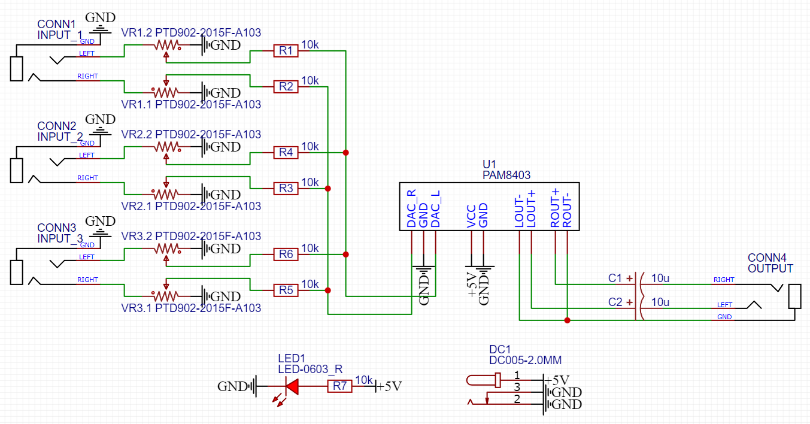
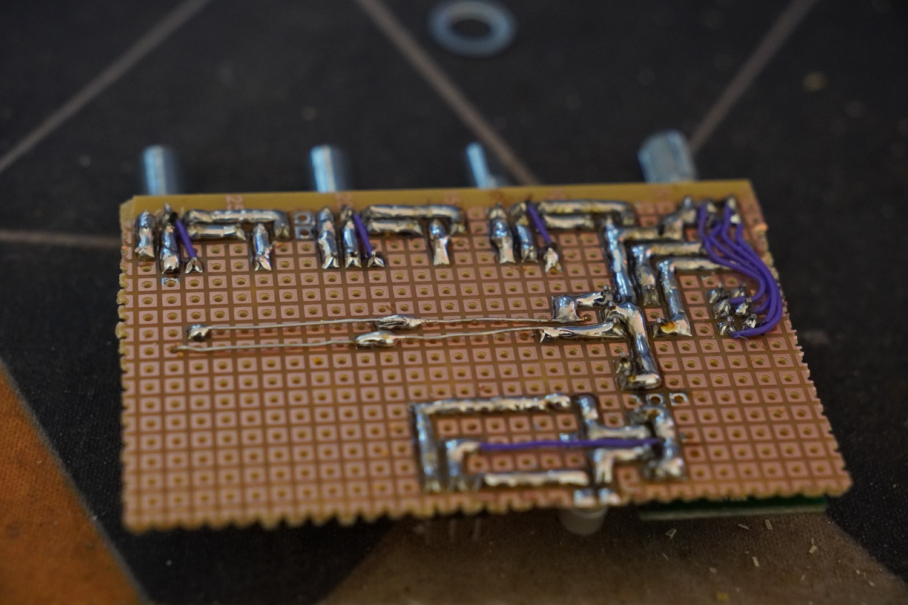
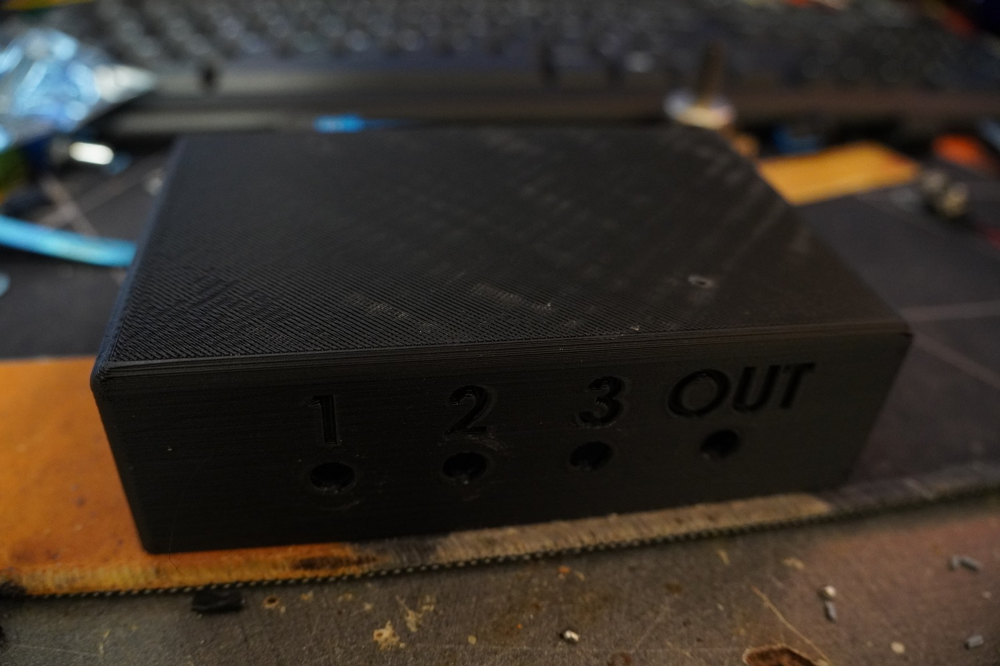
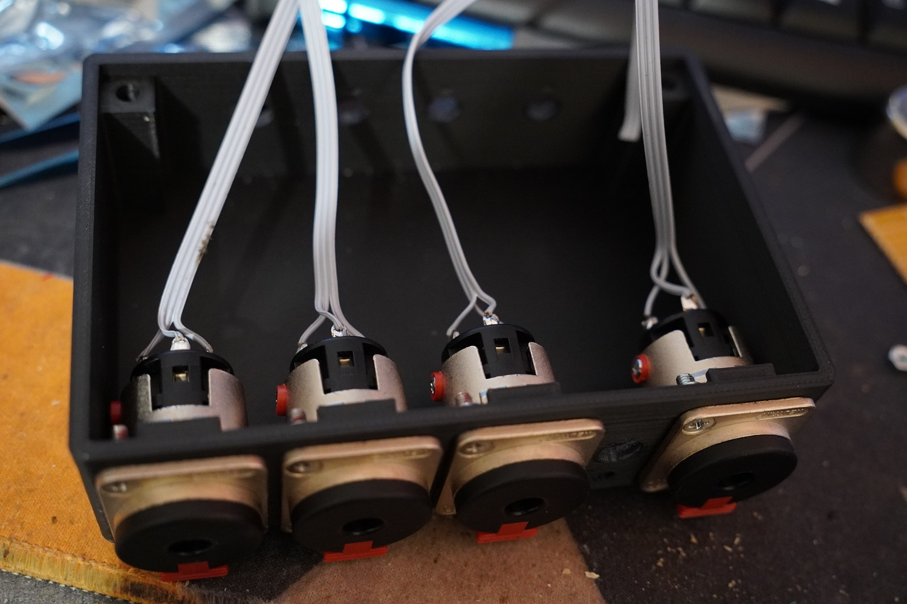
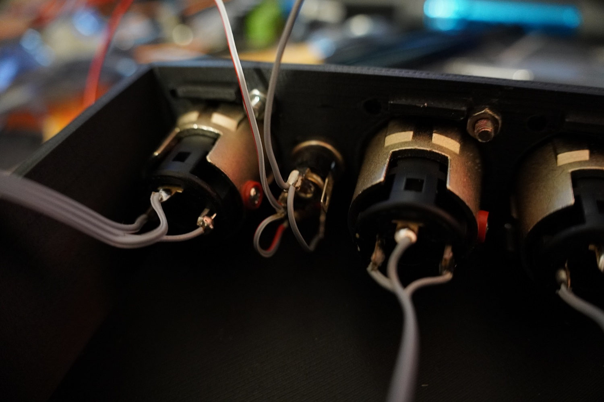
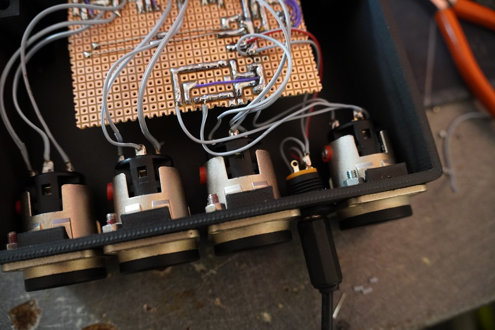

Making a very basic 3CH audio mixer with amplified output

<!--more-->

I'm working in the backstage of concerts of our local choir. We have an intercom system, it's based on the Clear Com party line system, but that's a story for another time.

My issue is that I need to hear the audio from my computer and the audio from the intercom, and I guess that my phone would be a nice idea too. I didn't want something complicated like pan control / EQs.

So to recap, I need:

- 3 Stereo inputs with individual volume control
- 1 Output with amplified output for my headphones

It's been a while since I did some manual soldering on a proto board, and I wanted to avoid waiting 2 weeks for a PCB.
So, I went to Farrell and Amazon and ordered a few things:

- 3x 10kOhm Log potentiometers
- DC Input jacks
- PAM8403 Amplifier boards
- 4x 6.35 mm TRS Jacks

## Schematic

The schematic is heavily inspired by this project [https://www.sonelec-musique.com/electronique_realisations_melangeur_audio_002.html](https://www.sonelec-musique.com/electronique_realisations_melangeur_audio_002.html), but with the PAM8403 replacing the op amp.

## Soldering

And now I remember why I design pcb instead of manually soldering them.

## Case

## Assembly

### Adding jack connectors

### Adding power connector

### Placing the PCB

## Final photos

images/DSC00714.JPG
images/DSC00719.JPG
images/DSC00721.JPG

## Final thoughts

Overall happy with this, not the greatest sound quality, especially because the PAM8403 isn't designed for headphones but it works.
