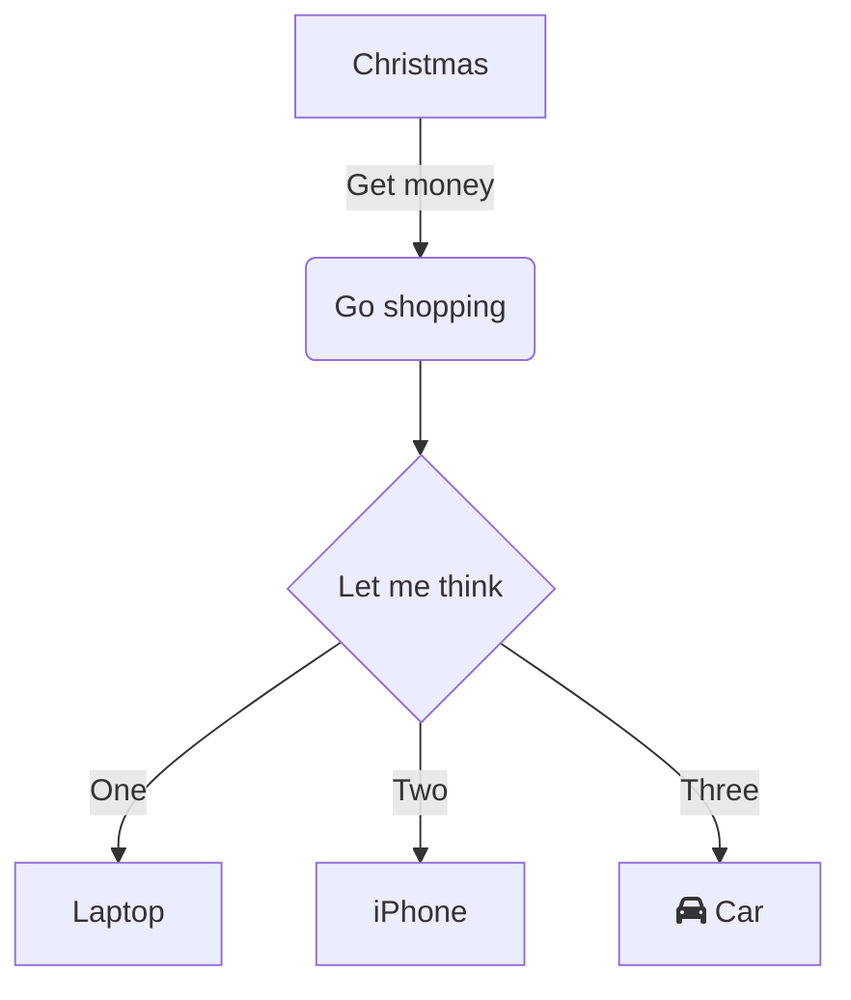

Lorem ipsum dolor sit amet, consectetur adipiscing elit, sed do eiusmod tempor 
incididunt ut labore et dolore magna aliqua. Pellentesque eu tincidunt tortor 
aliquam nulla facilisi cras fermentum odio. A erat nam at lectus urna duis. 
Sed velit dignissim sodales ut eu sem.

<!--more-->

Github Flavored Markdown (GFMD) is based on [Markdown Syntax Guide](http://daringfireball.net/projects/markdown/syntax) with some overwriting as described at [Github Flavored Markdown](http://github.github.com/github-flavored-markdown/)

## Text Writing
It is easy to write in GFMD. Just write simply like text and use the below simple "tagging" to mark the text and you are good to go!  

To specify a paragraph, leave 2 spaces at the end of the line

## Headings

```
# Sample H1
## Sample H2
### Sample H3
```

will produce
# Sample H1
## Sample H2
### Sample H3
#### Sample H4
##### Sample H5
###### Sample H6

---

## Horizontal Rules

Horizontal rule is created using `---` on a line by itself.

Test ==azerty== erggreg

---

## Coding - Block

<pre>
\`\`\`ruby
# The Greeter class
class Greeter
  def initialize(name)
    @name = name.capitalize
  end

  def salute
    puts "Hello #{@name}!"
  end
end

# Create a new object
g = Greeter.new("world")

# Output "Hello World!"
g.salute
\`\`\`
</pre>
 
will produce  

```ruby
# The Greeter class
class Greeter
  def initialize(name)
    @name = name.capitalize
  end

  def salute
    puts "Hello #{@name}!"
  end
end

# Create a new object
g = Greeter.new("world")

# Output "Hello World!"
g.salute
```

Note: You can specify the different syntax highlighting based on the coding language eg. ruby, sh (for shell), php, etc  
Note: You must leave a blank line before the `\`\`\``

## Coding - In-line
You can produce inline-code by using only one \` to enclose the code:

```
This is some code: `echo something`
```

will produce  

This is some code: `echo something`

---

## Text Formatting
**Bold Text** is done using `**Bold Text**`  
*Italic Text* is done using `*Italic Text*`

---

## Hyperlinks
- GFMD will automatically detect URL and convert them to links like this http://www.futureworkz.com
- To specify a link on a text, do this:

```
This is [an example](http://example.com/ "Title") inline link.
[This link](http://example.net/) has no title attribute.
```
This is [an example](http://example.com/ "Title") inline link.
[This link](http://example.net/) has no title attribute.

---

## Escape sequence
You can escape using \\ eg. \\\`

---

## Creating list

Adding a `-` will change it into a list:

```
- Item 1
- Item 2
- Item 3
```

will produce

- Item 1
- Item 2
- Item 3

---

## Quoting

You can create a quote using `>`:

```
> This is a quote
```

will produce

> This is a quote

## Table and Definition list

These two can only be created via HTML:

```html
<table>
  <tr>
    <th>ID</th><th>Name</th><th>Rank</th>
  </tr>
  <tr>
    <td>1</td><td>Tom Preston-Werner</td><td>Awesome</td>
  </tr>
  <tr>
    <td>2</td><td>Albert Einstein</td><td>Nearly as awesome</td>
  </tr>
</table>

<dl>
  <dt>Lower cost</dt>
  <dd>The new version of this product costs significantly less than the previous one!</dd>
  <dt>Easier to use</dt>
  <dd>We've changed the product so that it's much easier to use!</dd>
</dl>
```

will produce

<table>
  <tr>
    <th>ID</th><th>Name</th><th>Rank</th>
  </tr>
  <tr>
    <td>1</td><td>Tom Preston-Werner</td><td>Awesome</td>
  </tr>
  <tr>
    <td>2</td><td>Albert Einstein</td><td>Nearly as awesome</td>
  </tr>
</table>

<dl>
  <dt>Lower cost</dt>
  <dd>The new version of this product costs significantly less than the previous one!</dd>
  <dt>Easier to use</dt>
  <dd>We've changed the product so that it's much easier to use!</dd>
</dl>

| Syntax      | Description |
| ----------- | ----------- |
| Header      | Title       |
| Paragraph   | Text        |

## Adding Image

```

```


## Big Image


`#!php-inline $a = array("foo" => 0, "bar" => 1);`

## Definitions
Apple
:   Pomaceous fruit of plants of the genus Malus in 
    the family Rosaceae.

Orange
:   The fruit of an evergreen tree of the genus Citrus.

## Keyboard

++ctrl+alt+delete++

## Emojis

:smile: :heart: :thumbsup:

text with an emoji :thumbsup: lol

## Task List

- [X] item 1
    * [X] item A
    * [ ] item B
        more text
        + [x] item a
        + [ ] item b
        + [x] item c
    * [X] item C
- [ ] item 2
- [ ] item 3




~~test~~

Test: fefv https://www.youtube.com/watch?v=ytWz0qVvBZ0

https://www.youtube.com/watch?v=ytWz0qVvBZ0

https://twitter.com/Thom_astro/status/1511815389352759306

https://twitter.com/WholesomeMeme/status/1511696735227322370

https://twitter.com/G4GUO/status/1511765504721145863

https://twitter.com/netflix/status/1511849504156266496

https://twitter.com/MisterTechBlog/status/1511831453532712963

https://twitter.com/gleeda/status/1511789436601876483

https://twitter.com/Foone/status/1511808848729804803

https://stackoverflow.com/questions/6497548/chrome-extension-make-it-run-every-page-load

https://github.com/eried/portapack-mayhem

https://github.com/yukiisbored

https://github.com/eried/portapack-mayhem/issues/541

https://github.com/eried/portapack-mayhem/pull/547

https://github.com/TheStaticTurtle/MarkdownStick

https://wavesync.herokuapp.com/visualizer

https://mail.google.com

https://docs.djangoproject.com/en/4.0/intro/tutorial01/

https://www.reddit.com/r/DataHoarder/comments/txy10y/just_finished_building_my_new_plex_server/